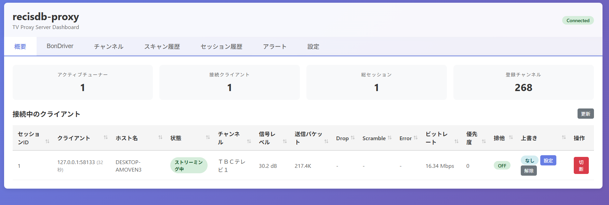
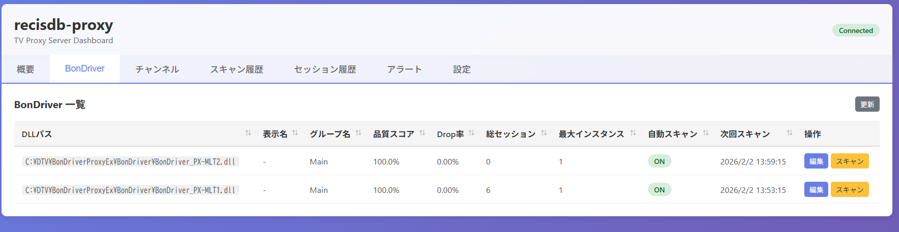
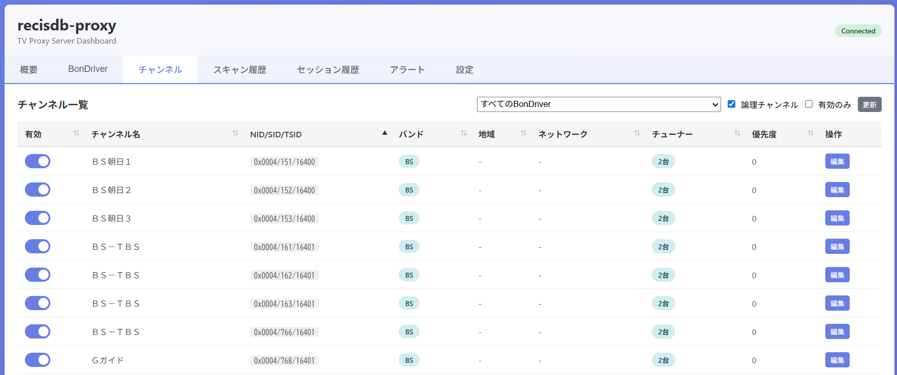
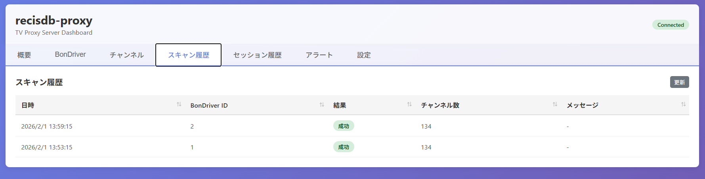
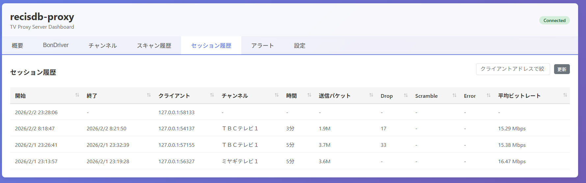
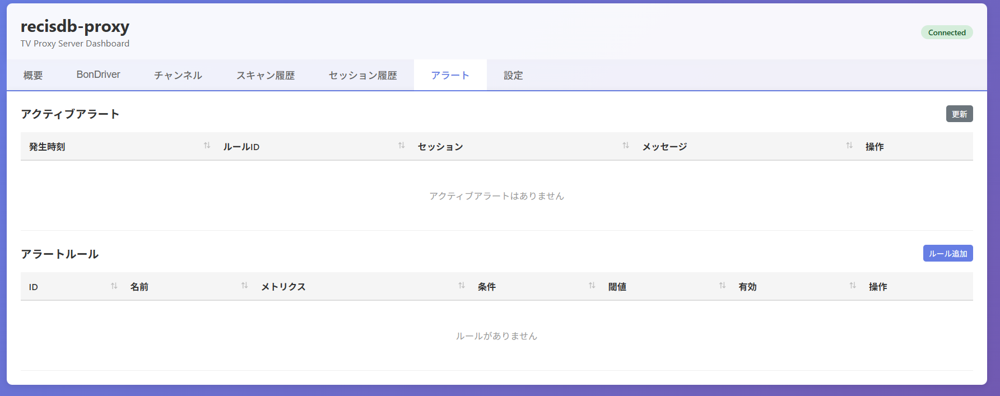
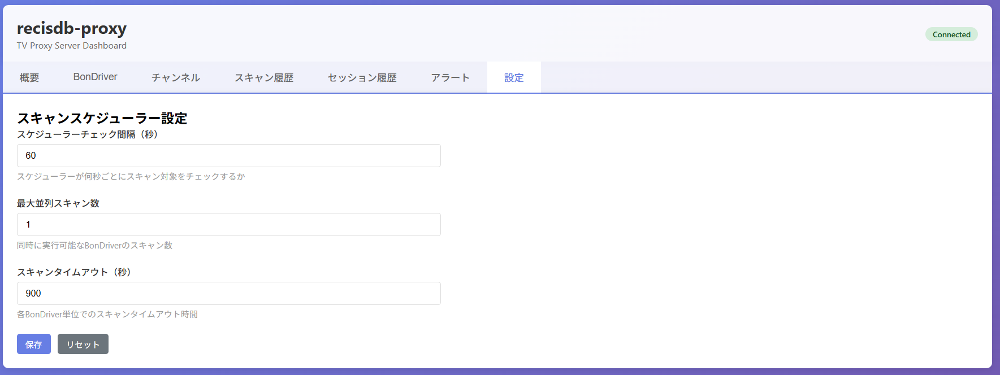
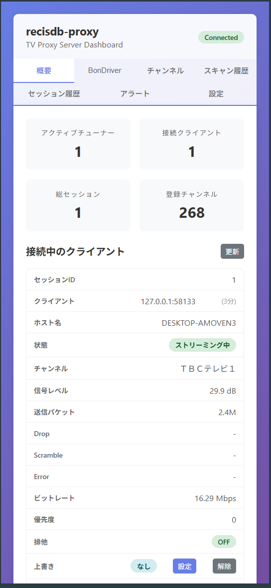

recisdb-proxy
==============

recisdb-proxy は、BonDriver をネットワーク経由で複数のクライアントに共有できるプロキシサーバーです。  
優先度・排他制御と Web ダッシュボードを備え、チューナーの利用状況を可視化しながら運用できます。

この README は Proxy 機能に特化した概要です。他クレートの詳細はドキュメントを参照してください。

---

## 主な機能

- **複数クライアント対応**: 複数の TVTest 等が同一サーバーの BonDriver にアクセス可能
- **チャンネル優先度制御**: クライアント側から優先度を指定
- **排他ロック機能**: 高優先度クライアントがチューナーを独占可能
- **インスタンス制限**: BonDriver ごとの同時使用チャンネル数を制限
- **Web ダッシュボード**: ブラウザからリアルタイム監視・DB 設定編集が可能

## 使い始める

### インストール

[Releases](https://github.com/stuayu/recisdb-proxy-rs/releases) から実行ファイルを取得してください。  
Linux では Debian パッケージ、Windows では x64 向け実行ファイルが提供されています。

### 起動例

```bash
recisdb-proxy --listen 0.0.0.0:12345 --web-listen 0.0.0.0:8080 -t <登録するBonDriverのパス>
```

### 設定ファイル

設定ファイルの例は [recisdb-proxy/recisdb-proxy.toml.example](recisdb-proxy/recisdb-proxy.toml.example) を参照してください。

```toml
[server]
listen = "0.0.0.0:12345"
web_listen = "0.0.0.0:8080"
tuner = Main
max_connections = 64
```

## Web ダッシュボード

デフォルトで http://localhost:8080 で利用可能です。以下を確認・設定できます。

- チューナーの利用状況（インスタンス数、最大制限など）
- 接続中のクライアント情報（セッション、IP アドレス、現在チャンネルなど）
- サーバー統計（セッション数、稼働時間など）
- **DB 設定値の直接編集**（max_instances、display_name など）
- チューナーグループの設定はWEB上から実施可能です。

### 画面キャプチャ

| ダッシュボード概要 | チューナー詳細 |
| --- | --- |
|  |  |
| **チャンネル一覧** | **チャンネルスキャン履歴** |
|  |  |
| **セッション履歴** | **アラート設定** |
|  |  |
| **グローバル設定** | **スマホ画面** |
|  |  |

詳細は [docs/WEB_DASHBOARD.md](docs/WEB_DASHBOARD.md) を参照してください。

## クライアント設定

TVTest などから接続するための設定例は [bondriver-proxy-client/BonDriver_NetworkProxy.ini.sample](bondriver-proxy-client/BonDriver_NetworkProxy.ini.sample) を参照してください。

## ビルド

Rust が必要です。Rust が未導入の場合は [Rustup](https://www.rust-lang.org/ja/tools/install) をインストールしてください。

```bash
# リポジトリを submodule を含めて clone
git clone --recursive https://github.com/stuayu/recisdb-proxy-rs.git
cd recisdb-proxy-rs

# ビルド(現在はデバッグビルドしかサポートしてません)
cargo build -p recisdb-proxy
```

ビルド結果は [target/debug/](target/debug/) に生成されます。

---

## ドキュメント

- [docs/ARCHITECTURE.md](docs/ARCHITECTURE.md)
- [docs/BonDriverCapacityControl.md](docs/BonDriverCapacityControl.md)
- [docs/PriorityChannelSelection.md](docs/PriorityChannelSelection.md)
- [docs/WEB_DASHBOARD.md](docs/WEB_DASHBOARD.md)

---

## Licence

[GPL v3](https://github.com/stuayu/recisdb-proxy-rs/blob/master/LICENSE)

## Special thanks

このアプリケーションは [recisdb-rs](https://github.com/kazuki0824/recisdb-rs) をベースに転送機能を組み込んで実装をしています。   
このアプリケーションは [px4_drv](https://github.com/nns779/px4_drv) を参考にして実装されています。  
また [libaribb25](https://github.com/tsukumijima/libaribb25) のラッパー実装を含んでいます。

This application has been implemented with reference to [px4_drv](https://github.com/nns779/px4_drv).  
It also contains a wrapper implementation of [libaribb25](https://github.com/tsukumijima/libaribb25).
