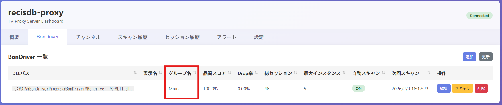
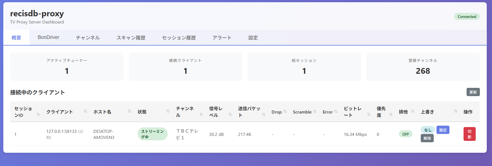
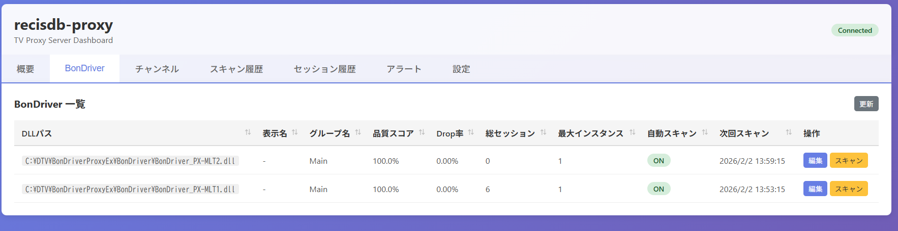
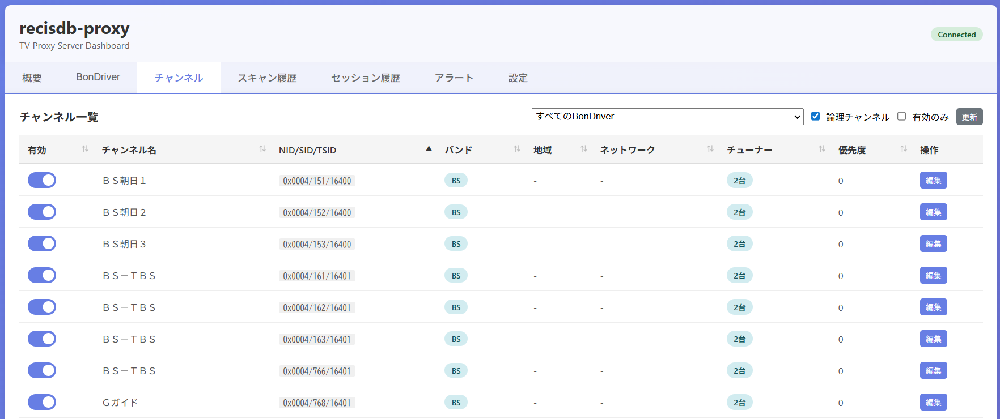
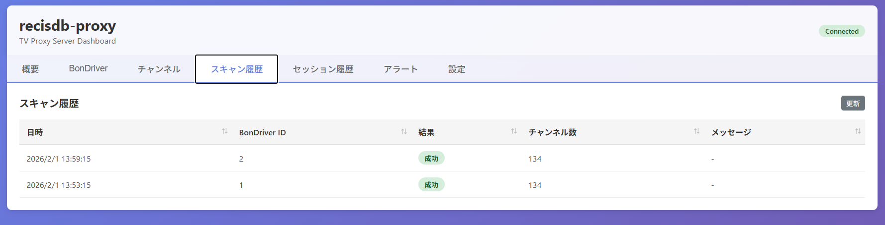
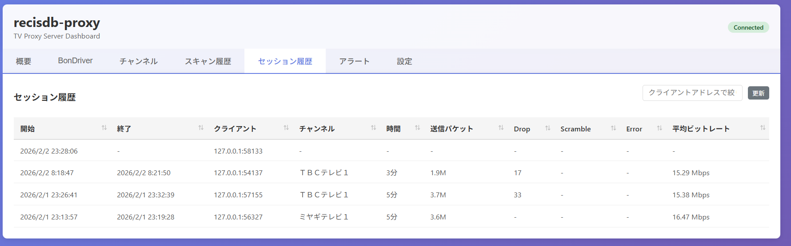
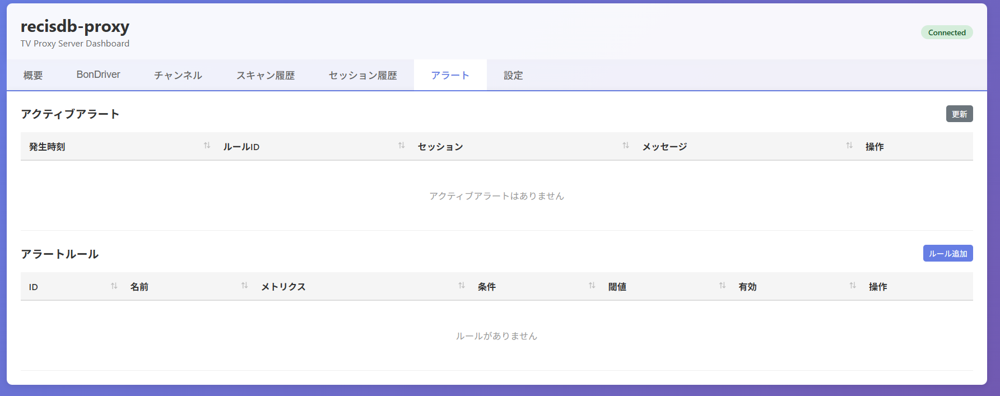
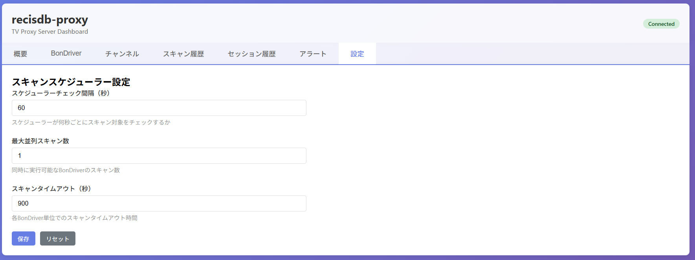
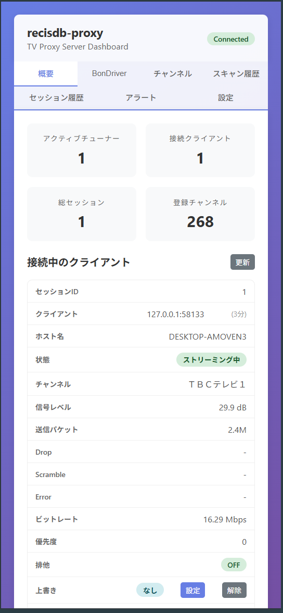

recisdb-proxy
==============

recisdb-proxy は、BonDriver をネットワーク経由で複数のクライアントに共有できるプロキシサーバーです。  
優先度・排他制御と Web ダッシュボードを備え、チューナーの利用状況を可視化しながら運用できます。

---

## 主な機能

- **複数クライアント対応**: 複数の TVTest 等が同一サーバーの BonDriver にアクセス可能
- **チャンネル優先度制御**: クライアント側から優先度を指定
- **排他ロック機能**: 高優先度クライアントがチューナーを独占可能
- **インスタンス制限**: BonDriver ごとの同時使用チャンネル数を制限
- **サービスフィルタ**: 単一サービス (SID) のみ配信するモードで帯域削減
- **チューナーグループ**: 同種チューナーの自動選択・負荷分散
- **チャンネルスキャン**: 自動 / 手動によるチャンネルスキャン・パッシブスキャン
- **アラート**: ドロップ率やビットレート等のメトリクスしきい値でアラート通知 (Webhook 対応)
- **Web ダッシュボード**: ブラウザからリアルタイム監視・DB 設定編集が可能
- **TLS 対応** (オプション): クライアント⇔サーバー間を暗号化
- **初回セットアップツール**: 対話式でチューナーの自動検出・DB 初期化・設定ファイル生成

## プロジェクト構成

| クレート | 概要 |
| --- | --- |
| `recisdb-proxy` | ネットワークプロキシサーバー本体 (メインバイナリ + セットアップツール) |
| `bondriver-proxy-client` | BonDriver クライアント DLL (TVTest 等から利用) |
| `recisdb-protocol` | クライアント⇔サーバー間プロトコル定義 |
| `recisdb-rs` | CLI チューナー操作ツール (recpt1/dvbv5-zap 代替) |
| `b25-sys` | ARIB STD-B25 (CAS デコーダー) FFI ラッパー |

## 使い始める

### インストール

[Releases](https://github.com/stuayu/recisdb-proxy-rs/releases) から実行ファイルを取得してください。  
Windows では x64 向け実行ファイルが提供されています。

### 起動
同梱している`recisdb-proxy.toml.example`と`BonDriver_NetworkProxy.ini.sample`を確認します。  
.exampleと.sampleを削除して保存します。  

- `recisdb-proxy.toml`については、特に編集不要で使用できます。
  - デフォルトのチューナーデバイスパスは実質未使用なので、指定しないでください。
  - ログレベルは、コンソール画面とテキストファイルに書き込むログレベルを設定できます。
  - TLS設定は、未使用のため有効化しないでください。
- `BonDriver_NetworkProxy.ini`については、チューナーグループ名`Tuner =`を設定する必要があります。
  - WEB画面で設定したグループ名を設定します。フルパス指定ではテストしていないため、動作しない可能性があります。
  - サービスフィルタモードは、allをメインでテストしているので当分の間はallで使用してください。
  - TLS設定は、テストしていないので使用しないでください。
  - ログ設定は、TVTest等でチューナーを開いた場合に自動的にテキストファイルにログを書き込みます。問題調査の用途として、debug, traceも指定可能です。

Windowsの場合は、下記をダブルクリックして実行します。  
`recisdb-proxy.exe`

Linuxの場合は、下記のコマンドを実行します。(Linuxは/dev/px4**にアクセスする場合システム権限が必要です)  
`sudo ./recisdb-proxy`

Systemd登録用に下記のテンプレートも参考にしてください。  
`recisdb-proxy\recisdb-proxy-rs.service`


### GUIからのサーバー設定

`http://localhost:40080`を起動し、BonDriverタブを開きます。  
「追加」ボタンを押下して、各種設定を入力します。
初回のみ自動スキャン or 手動でチャンネル設定が必要になります。（自動スキャンがおすすめです。不要なチャンネルがあればトグルでOFFにしてください）  

チューナーを追加後に、下記のグループ名にセットした名称を`BonDriver_NetworkProxy.ini`に設定してください。



### 主な CLI オプション

| オプション | デフォルト | 説明 |
| --- | --- | --- |
| `--listen` | `0.0.0.0:40070` | プロキシサーバーの待ち受けアドレス |
| `--web-listen` | `0.0.0.0:40080` | Web ダッシュボードの待ち受けアドレス |
| `-t, --tuner` | ― | デフォルトのチューナーパス (DLL パスまたはデバイスパス) |
| `-d, --database` | `recisdb-proxy.db` | SQLite データベースファイルのパス |
| `-f, --config` | ― | 設定ファイルのパス |
| `-c, --max-connections` | `64` | 最大同時接続数 |
| `--enable-scan` | `true` | 自動チャンネルスキャンの有効化 |
| `--scan-on-start` | `false` | 起動時に即時スキャンを実行 |
| `--scan-interval` | `60` | スキャンチェック間隔 (秒) |
| `--log-dir` | `logs` | ログファイルの保存先 |
| `--log-retention-days` | `7` | ログの保持日数 |
| `-v, --verbose` | `false` | 詳細ログの有効化 |

### 設定ファイル

設定ファイルの例は [recisdb-proxy/recisdb-proxy.toml.example](recisdb-proxy/recisdb-proxy.toml.example) を参照してください。

```toml
[server]
listen = "0.0.0.0:40070"
web_listen = "0.0.0.0:40080"
max_connections = 64

[database]
path = "recisdb-proxy.db"

[logging]
log_dir = "logs"
retention_days = 7
# level = "warn"
```

TLS 設定やログレベルなどの詳細は設定ファイルの例にコメントで記載されています。

## Web ダッシュボード

デフォルトで http://localhost:40080 で利用可能です。以下を確認・設定できます。

- チューナーの利用状況（インスタンス数、最大制限など）
- 接続中のクライアント情報（セッション、IP アドレス、現在チャンネルなど）
- サーバー統計（セッション数、稼働時間など）
- **チューナー設定の編集**（max_instances、display_name など）
- チューナーグループの設定
- チャンネルスキャン履歴の確認
- アラートルールの設定・Webhook 通知

### 画面キャプチャ

| ダッシュボード概要 | チューナー詳細 |
| --- | --- |
|  |  |
| **チャンネル一覧** | **チャンネルスキャン履歴** |
|  |  |
| **セッション履歴** | **アラート設定** |
|  |  |
| **グローバル設定** | **スマホ画面** |
|  |  |

詳細は [docs/WEB_DASHBOARD.md](docs/WEB_DASHBOARD.md) を参照してください。

## クライアント設定 (BonDriver_NetworkProxy)

TVTest などから接続するための BonDriver クライアント DLL の設定は [bondriver-proxy-client/BonDriver_NetworkProxy.ini.sample](bondriver-proxy-client/BonDriver_NetworkProxy.ini.sample) を参照してください。

主な設定項目:

| 項目 | 説明 |
| --- | --- |
| `Address` | プロキシサーバーのアドレス (IP:ポート) |
| `Tuner` | チューナーパスまたはグループ名 (空欄でサーバーのデフォルトを使用) |
| `Priority` | クライアントの優先度 (数値が大きいほど優先) |
| `Exclusive` | 排他ロックモード (`0` = 共有, `1` = 排他) |
| `ServiceFilter` | `all` = 全サービス受信, `single` = 選択サービスのみ |

環境変数 (`BONDRIVER_PROXY_*` プレフィックス) でも設定可能です。

## ビルド

Rust が必要です。Rust が未導入の場合は [Rustup](https://www.rust-lang.org/ja/tools/install) をインストールしてください。

```bash
# リポジトリを submodule を含めて clone
git clone --recursive https://github.com/stuayu/recisdb-proxy-rs.git
cd recisdb-proxy-rs

# ビルド
cargo build -p recisdb-proxy
```

ビルドすると以下の 2 つのバイナリが生成されます:

| バイナリ | 説明 |
| --- | --- |
| `recisdb-proxy` | プロキシサーバー本体 |
| `recisdb-proxy-setup` | 対話式初回セットアップツール |

### Feature flags

| フィーチャー | デフォルト | 説明 |
| --- | --- | --- |
| `webhook` | ✅ | アラート Webhook 通知 (reqwest) |
| `tls` | ― | TLS 暗号化 (rustls) |

```bash
# TLS 対応ビルド
cargo build -p recisdb-proxy --features tls
```

---

## ドキュメント

- [docs/QUICKSTART.md](docs/QUICKSTART.md) — クイックスタートガイド
- [docs/ARCHITECTURE.md](docs/ARCHITECTURE.md) — アーキテクチャ概要
- [docs/BonDriverCapacityControl.md](docs/BonDriverCapacityControl.md) — BonDriver インスタンス制限
- [docs/PriorityChannelSelection.md](docs/PriorityChannelSelection.md) — 優先度チャンネル選択
- [docs/ClientConnectionSequence.md](docs/ClientConnectionSequence.md) — クライアント接続シーケンス
- [docs/WEB_DASHBOARD.md](docs/WEB_DASHBOARD.md) — Web ダッシュボード仕様
- [docs/LOGGING.md](docs/LOGGING.md) — ログ設計

---

## Licence

[GPL v3](https://github.com/stuayu/recisdb-proxy-rs/blob/master/LICENSE)

## Special thanks

このアプリケーションは [recisdb-rs](https://github.com/kazuki0824/recisdb-rs) をベースに転送機能を組み込んで実装をしています。   
このアプリケーションは [px4_drv](https://github.com/nns779/px4_drv) を参考にして実装されています。  
また [libaribb25](https://github.com/tsukumijima/libaribb25) のラッパー実装を含んでいます。

This application has been implemented with reference to [px4_drv](https://github.com/nns779/px4_drv).  
It also contains a wrapper implementation of [libaribb25](https://github.com/tsukumijima/libaribb25).

## 不具合報告等
Twitter(X)/Githubにてメンションいただければ幸いです。  
本業が忙しく反応できない場合がありますので、気長にお待ちください。反応なくても読んでいる場合があります。
