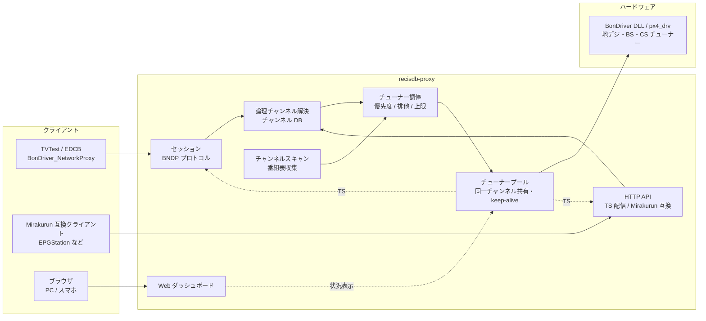
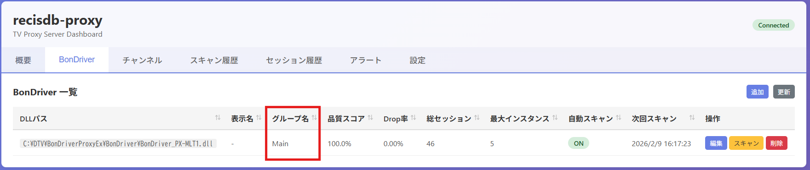
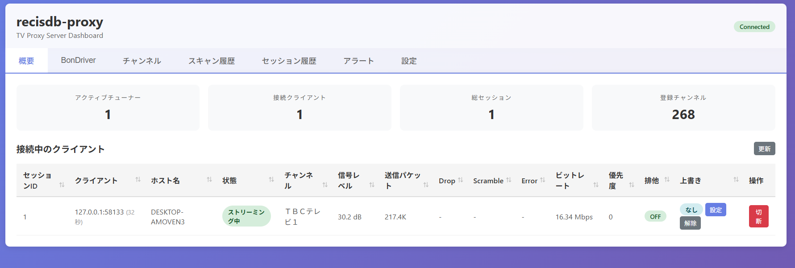
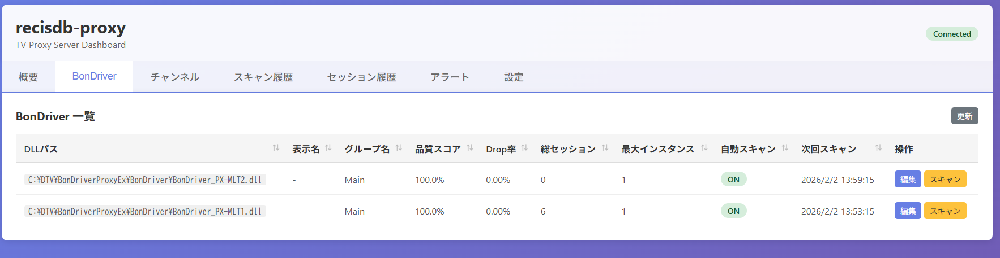
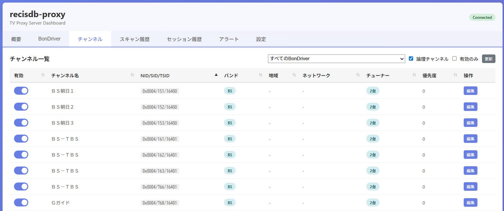
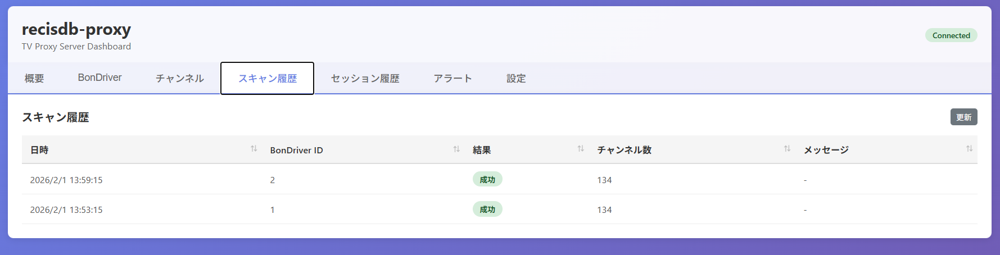
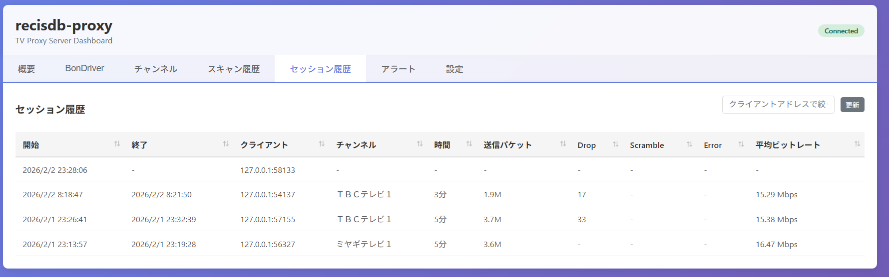
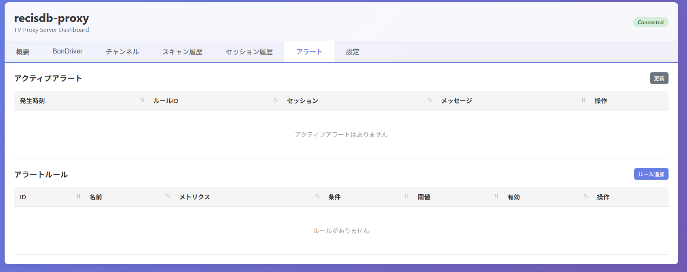
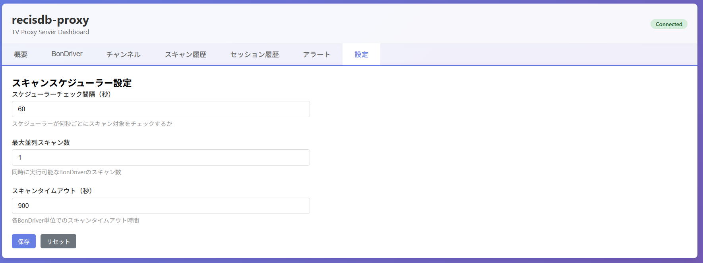
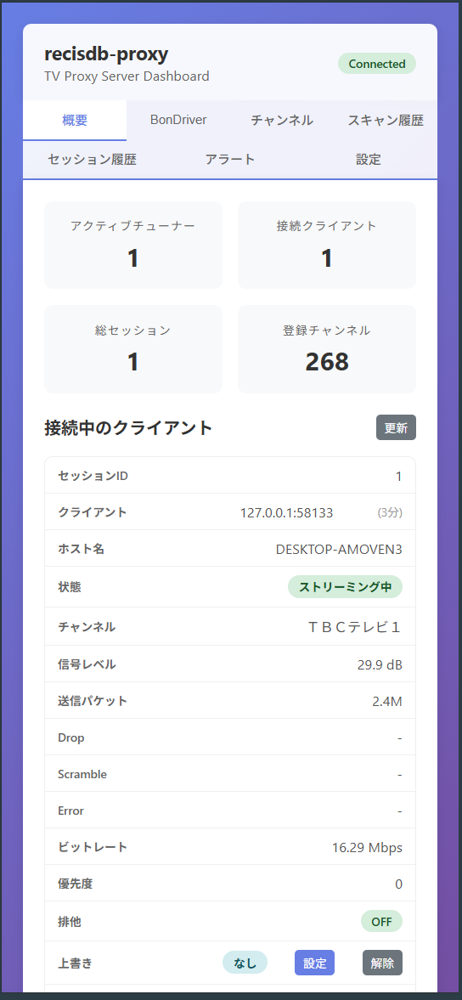

recisdb-proxy
==============

recisdb-proxy は、BonDriver をネットワーク経由で複数のクライアントに共有できるプロキシサーバーです。  
優先度・排他制御と Web ダッシュボードを備え、チューナーの利用状況を可視化しながら運用できます。

---

## システム全体像

1 台のサーバーがチューナーを一元管理し、視聴・録画・チャンネルスキャン・番組表収集の
すべてが同じ「チューナーの取り合い」に参加します。誰がどのチューナーを使うかは 1 か所で
決まるため、「録画中にスキャンが走ってチューナーを奪われた」といった事故が起きません。


```mermaid
flowchart LR
    subgraph クライアント
        TV[TVTest / EDCB<br/>BonDriver_NetworkProxy]
        MK[Mirakurun 互換クライアント<br/>EPGStation など]
        WEB[ブラウザ<br/>PC / スマホ]
    end

    subgraph サーバー [recisdb-proxy]
        SESS[セッション<br/>BNDP プロトコル]
        HTTP[HTTP API<br/>TS 配信 / Mirakurun 互換]
        DASH[Web ダッシュボード]
        RESOLV[論理チャンネル解決<br/>チャンネル DB]
        ACQ[チューナー調停<br/>優先度 / 排他 / 上限]
        POOL[チューナープール<br/>同一チャンネル共有・keep-alive]
        SCAN[チャンネルスキャン<br/>番組表収集]
    end

    subgraph ハードウェア
        HW[BonDriver DLL / px4_drv<br/>地デジ・BS・CS チューナー]
    end

    TV --> SESS
    MK --> HTTP
    WEB --> DASH
    SESS --> RESOLV
    HTTP --> RESOLV
    RESOLV --> ACQ
    SCAN --> ACQ
    ACQ --> POOL
    POOL --> HW
    POOL -.TS.-> SESS
    POOL -.TS.-> HTTP
    DASH -.状況表示.-> POOL
```

- **論理チャンネル解決**: クライアントが要求したチャンネルを、チャンネル DB をもとに
  「どのチューナーの、どの空間・チャンネル番号か」へ変換します。同じ放送を受けられる
  チューナーが複数あれば、候補としてすべて並べます。
- **チューナー調停**: 候補の中から実際に使うチューナーを 1 か所で決めます。空きがなければ
  優先度・排他フラグを見て退避の可否を判断します。判断は純粋な決定関数として分離されて
  おり、単体テストで挙動が固定されています。
- **チューナープール**: 同じチャンネルを見ている視聴者は 1 つの受信を共有します。最後の
  視聴者が去ってもしばらく受信を維持する (keep-alive) ため、チャンネルを戻したときは
  即座に映ります。
- **スキャン・番組表収集**: これらも視聴と同じ枠を予約してから走ります。視聴中の
  チューナーを奪うことはなく、逆にスキャン中のチューナーは「使用中」として扱われます。

詳しい状態遷移や退避判定の図は [docs/DESIGN.md](docs/DESIGN.md) の
「§4.4.1 図解: チューナーを取り合う全経路」を参照してください。

## 設計ポリシー (BonDriverProxy-EX との違い)

BonDriverProxy / BonDriverProxy-EX と同じく「BonDriver をネットワーク越しに共有する」
道具ですが、recisdb-proxy は **チューナーが足りない状況でも破綻しないこと** と
**運用中に状況が見えること** を重視して設計しています。

| | BonDriverProxy-EX 系の一般的な構成 | recisdb-proxy |
| --- | --- | --- |
| チャンネル指定 | BonDriver の空間・チャンネル番号をそのまま透過 | チャンネル DB による**論理チャンネル**。ドライバごとの番号の違いを吸収し、同じ放送を受けられる**別のチューナーへ自動で振り替え** |
| チューナー選択 | クライアントの接続順・設定に依存 | 候補の中から**優先度・排他・空き状況を見て 1 か所で決定**。判断ロジックは純粋関数として分離しテスト済み |
| 空きがないとき | 接続失敗、または横取り | 明文化された退避ルール (下記)。**上限を超えた受信は絶対に作らない** |
| チャンネルスキャン | 別ツール・手動 | サーバーが**視聴と同じ枠を予約して**実行。自動スキャン・パッシブスキャンあり |
| 番組表 | なし | EIT を収集して DB に保存し、API で配信 |
| 監視 | ログのみ | **Web ダッシュボード**でチューナー状況・接続クライアント・ドロップ率・ログを可視化。**スマホ対応必須**を規約化 |
| BonDriver 以外から使う | 不可 | **Mirakurun 互換 API** と HTTP での TS 取得に対応 (EPGStation 等から利用可) |
| 動作環境 | Windows | Windows / Linux / macOS。Linux・macOS では BonDriver DLL なしで px4_drv 系チューナーを直接利用 |
| B25 デコード | クライアント側 | **サーバー側**で実施可能。クライアント機に B-CAS カードリーダー不要 |
| 障害時 | 手動で開き直し | クライアントが**指数バックオフで自動再接続**し、チャンネル・ストリーミング状態を復元 |
| 導入 | 設定ファイルを手書き | **GUI セットアップウィザード**でチューナー自動検出から起動まで完結。クライアント用 INI・`.ch2`・`ChSet` も自動生成 |

※ 比較は一般的な構成を対象としたものです。BonDriverProxy-EX は派生・改造版が多く、
版によっては上記と異なる場合があります。

### チューナーの取り合いに関するルール

チューナーが足りないときの挙動を、次のとおり明文化しています (すべて実機で検証済み)。

- **同じ優先度なら奪わない。** 先に見ている人が勝ちます。後から来た同優先度の要求は
  別のチューナーを探し、なければ失敗します。
- **排他 (`Exclusive`) は同点に勝つ。** 録画のように中断できない用途は、同じ優先度でも
  確実にチューナーを確保できます。
- **上限は絶対に超えない。** 空きがないのに受信を増やすことはせず、退避してから作り直します。
- **選局直後のチューナーは守られる。** まだ映像が流れ始めていないチューナーを
  「誰も見ていない」とみなして奪うことはありません。
- **keep-alive で残っているだけの受信は譲る。** 誰も見ていない残骸が新しい視聴を
  妨げることはありません。
- **スキャンは視聴に譲る。** 使用中のチューナーではスキャンを開始せず、次の機会に回します。

## 主な機能

- **複数クライアント対応**: 複数の TVTest 等が同一サーバーの BonDriver にアクセス可能
- **チャンネル優先度制御**: クライアント側から優先度を指定
- **排他ロック機能**: 高優先度クライアントがチューナーを独占可能
- **インスタンス制限**: BonDriver ごとの同時使用チャンネル数を制限
- **サービスフィルタ**: 単一サービス (SID) のみ配信するモードで帯域削減
- **チューナーグループ**: 同種チューナーの自動選択・負荷分散
- **チャンネルスキャン**: 自動 / 手動によるチャンネルスキャン・パッシブスキャン
- **番組表 (EPG)**: EIT を収集して DB に保存し、API で配信
- **Mirakurun 互換 API**: EPGStation 等の BonDriver 以外のクライアントからも利用可能
- **サーバー側 B25 デコード**: クライアント機に B-CAS カードリーダーが不要
- **マルチプラットフォーム**: Windows / Linux / macOS。Linux・macOS では px4_drv 系チューナーを直接利用
- **アラート**: ドロップ率やビットレート等のメトリクスしきい値でアラート通知 (Webhook 対応)
- **Web ダッシュボード**: ブラウザからリアルタイム監視・DB 設定編集が可能
- **TLS 対応** (オプション): クライアント⇔サーバー間を暗号化
- **かんたんセットアップ**: GUIウィザードでチューナーの自動検出・設定ファイル生成・起動まで、コマンド入力なしで完了

## プロジェクト構成

| クレート | 概要 |
| --- | --- |
| `recisdb-proxy` | ネットワークプロキシサーバー本体 (メインバイナリ + セットアップツール) |
| `bondriver-proxy-client` | BonDriver クライアント DLL (TVTest 等から利用) |
| `recisdb-protocol` | クライアント⇔サーバー間プロトコル定義 |
| `recisdb-rs` | CLI チューナー操作ツール (recpt1/dvbv5-zap 代替) |
| `b25-sys` | ARIB STD-B25 (CAS デコーダー) FFI ラッパー |

## 使い始める

### インストール

[Releases](https://github.com/stuayu/recisdb-proxy-rs/releases) から実行ファイルを取得してください。

| プラットフォーム | アセット |
| --- | --- |
| Windows x64 / x86 | `recisdb-{tag}-win-x64.zip` / `-win-x86.zip` |
| Linux amd64 / arm64 | `recisdb-proxy-{tag}-linux-amd64.tar.gz` / `-linux-arm64.tar.gz` |
| macOS Intel / Apple Silicon | `recisdb-proxy-{tag}-macos-amd64.tar.gz` / `-macos-arm64.tar.gz` |

上記以外の環境ではソースからビルドしてください (後述の [ビルド](#ビルド) と
[docs/BUILD.md](docs/BUILD.md))。

Linux / macOS はコマンドをコピー&ペーストするだけで導入できます
([Linux へのインストール](#linux-へのインストール-コピペで完了) /
[macOS へのインストール](#macos-へのインストール-コピペで完了))。

### かんたんセットアップ (はじめての方はこちら)

プログラムに慣れていない方は、`recisdb-proxy-setup.exe` をダブルクリックして起動してください。  
画面の指示に従って「次へ」を押していくだけで、次の作業がすべて完了します。

1. インストール先フォルダの選択 (既定値: `C:\DTV\recisdb-proxy-rs`。「参照…」ボタンで変更可能)
2. `recisdb-proxy` 本体・設定ファイル (`recisdb-proxy.toml`) の配置
3. チューナーの自動検出・登録
4. `recisdb-proxy` 本体の起動、Web ダッシュボードのオープンまで

コマンドライン入力は一切不要です。`recisdb-proxy-setup.exe` は `recisdb-proxy.exe` と同じフォルダ(ダウンロードしたzipの展開先)に置いて実行してください。既に同じフォルダにインストール済みの場合は、設定ファイルやデータベースはそのままに、本体プログラムだけが古ければ最新版に更新されます。

**PLEX / e-Better 製チューナー (PX-W3U4, PX-Q3U4, PX-MLT5PE/8PE, PX-M1UR/S1UR, DTV02A/03A 等) をお使いの場合**、
接続済みでドライバ未インストールのデバイスも自動検出し、ボタン1つで
[tsukumijima/px4_drv](https://github.com/tsukumijima/px4_drv) (WinUSB版) の最新ビルドを
[tsukumijima/DTV-Builds](https://github.com/tsukumijima/DTV-Builds) からダウンロードして
ドライバ・BonDriverのインストールまで行います。ドライバインストール時のみ管理者権限の確認 (UAC) が表示されます。

### Linux へのインストール (コピペで完了)

以下のコマンドは順に貼り付けるだけで動きます (Debian / Ubuntu 系を想定。他のディストリ
ではパッケージ名だけ読み替えてください)。インストール先は `/opt/recisdb-proxy` とします。

**動作要件 (配布バイナリを使う場合)**

| 項目 | 要件 |
| --- | --- |
| CPU | x86_64 または aarch64 (**64bit OS のみ**。32bit の armhf / armv7l 版バイナリは配布していません) |
| glibc | **2.34 以上** — Ubuntu 22.04+ / Debian 12 (bookworm) 以降。Debian 11 (bullseye) では動きません |
| OpenSSL | **3.x** (`libssl.so.3` / `libcrypto.so.3` を動的リンク)。bookworm / 22.04 なら標準で入っています |

要件を満たさない環境 (Debian 11、32bit OS など) では、[ビルド](#ビルド) の手順で
ソースからビルドしてください。glibc は `ldd --version`、アーキテクチャは `uname -m`
で確認できます。

> **Raspberry Pi の場合**: **64bit 版の Raspberry Pi OS (bookworm 以降)** または
> Ubuntu Server arm64 を使ってください。`uname -m` が `aarch64` と表示されれば
> そのまま下の手順が通ります。`armv7l` と表示される場合は 32bit OS なので、
> 64bit 版を入れ直すかソースからビルドする必要があります。
> チューナーを複数挿す場合は、USB の給電が不足しやすいのでセルフパワーの
> USB ハブを使うと安定します。

**1. 最新版をダウンロードして展開する**

```bash
# アーキテクチャを判定して、最新リリースのtar.gzを取得する
REPO=stuayu/recisdb-proxy-rs
case "$(uname -m)" in
  x86_64)  LABEL=linux-amd64 ;;
  aarch64) LABEL=linux-arm64 ;;
  armv7l|armv6l)
    echo "32bit OS では配布バイナリを利用できません。64bit OS を使うか、ソースからビルドしてください。"
    return 2>/dev/null || exit 1 ;;
  *) echo "未対応のアーキテクチャ: $(uname -m)"; return 2>/dev/null || exit 1 ;;
esac
TAG=$(wget -qO- "https://api.github.com/repos/$REPO/releases" | grep -m1 '"tag_name"' | cut -d'"' -f4)
echo "取得するバージョン: $TAG ($LABEL)"

wget -O /tmp/recisdb-proxy.tar.gz \
  "https://github.com/$REPO/releases/download/$TAG/recisdb-proxy-$TAG-$LABEL.tar.gz"

# /opt/recisdb-proxy へ展開する (アーカイブは1階層のフォルダに入っているので --strip-components=1)
sudo mkdir -p /opt/recisdb-proxy
sudo tar xzf /tmp/recisdb-proxy.tar.gz -C /opt/recisdb-proxy --strip-components=1
sudo chmod +x /opt/recisdb-proxy/recisdb-proxy
ls -l /opt/recisdb-proxy
```

> リリースはプレリリース (alpha) を含むため、`releases/latest` ではなく `releases` の
> 先頭 (= 最新のリリース) を取得しています。特定のバージョンを入れたい場合は
> `TAG=0.0.1-alpha.6` のように直接指定してください。

**2. 設定ファイルを用意する**

```bash
sudo cp /opt/recisdb-proxy/recisdb-proxy.toml.example /opt/recisdb-proxy/recisdb-proxy.toml
```

同じ PC 以外のブラウザからダッシュボードを開く場合は、`recisdb-proxy.toml` の
`web_listen` が `0.0.0.0:40080` になっていることを確認してください
(設定ファイルを使わない場合、Web ダッシュボードの既定は `127.0.0.1:40080` =
そのPCからのみアクセス可能です)。

**3. B-CAS カードリーダーを使う場合 (サーバー側で B25 デコードするなら必須)**

```bash
sudo apt update
sudo apt install -y pcscd libpcsclite1 libccid
sudo systemctl enable --now pcscd
pcsc_scan   # 任意: カードリーダーが見えるか確認 (pcsc-tools パッケージ)
```

recisdb-proxy は PC/SC ライブラリを実行時に `dlopen` します
(`libpcsckai.so` → `libpcsclite.so.1` → `libpcsclite.so` の順。`B25_PCSC_LIB` で明示指定も可能)。
どれも見つからない・`pcscd` が動いていない場合はカードリーダー初期化に失敗し、
スクランブルされたままの TS が流れます。`RUST_LOG=info` で起動すると
`pcsc_shim: using PC/SC backend ...` として実際に使われたライブラリが出ます。

**4. チューナー (px4_drv) の準備**

Linux では [px4_drv](https://github.com/tsukumijima/px4_drv) が作るキャラクタデバイス
(`/dev/px4video*`, `/dev/pxmlt5video*`, `/dev/isdb2056video*` など) を直接開きます。
ドライバの導入は px4_drv 側の手順に従ってください。

既定ではこれらのデバイスは root しか開けないため、`sudo ./recisdb-proxy` で動かすか、
udev ルールを入れて一般ユーザーでも開けるようにします (**サービス登録して常時稼働
させる場合は、後者の方が安全です**)。

```bash
# 一般ユーザー(videoグループ)でチューナーを開けるようにする
sudo tee /etc/udev/rules.d/99-px4video.rules >/dev/null <<'EOF'
KERNEL=="px4video*",     GROUP="video", MODE="0660"
KERNEL=="pxmlt*video*",  GROUP="video", MODE="0660"
KERNEL=="isdb*video*",   GROUP="video", MODE="0660"
KERNEL=="pt*video*",     GROUP="video", MODE="0660"
EOF
sudo udevadm control --reload-rules && sudo udevadm trigger
sudo usermod -aG video "$USER"   # 反映にはログインし直しが必要
```

> デバイス名はお使いのチューナーとドライバのバージョンで変わります。
> `ls /dev | grep video` で実際の名前を確認し、必要ならルールを足してください。

**5. 起動して動作を確認する**

```bash
cd /opt/recisdb-proxy
sudo ./recisdb-proxy          # udevルールを入れて video グループに入っているなら sudo 不要
```

ブラウザで `http://<サーバーのIP>:40080` を開き、「BonDriver」タブからチューナーを
登録 → チャンネルスキャンを実行します (チューナーパスには `/dev/px4video0` のような
デバイスパスを入力します)。

動作が確認できたら、次の [サービスとして常時稼働させる](#サービスとして常時稼働させる)
へ進んでください。

> **注意**: データベース (`recisdb-proxy.db`) とログ (`logs/`) は**カレントディレクトリ
> 基準**で作られます。`sudo ./recisdb-proxy` を別のディレクトリで実行すると、別の DB が
> できてチャンネル設定が消えたように見えます。必ず `/opt/recisdb-proxy` に `cd` してから
> 実行してください (サービス登録した場合は `WorkingDirectory` が固定されるので気にする
> 必要はありません)。

### macOS へのインストール (コピペで完了)

**1. 最新版をダウンロードして展開する**

```bash
REPO=stuayu/recisdb-proxy-rs
case "$(uname -m)" in
  arm64)  LABEL=macos-arm64 ;;   # Apple Silicon
  x86_64) LABEL=macos-amd64 ;;   # Intel
esac
TAG=$(curl -fsSL "https://api.github.com/repos/$REPO/releases" | grep -m1 '"tag_name"' | cut -d'"' -f4)
echo "取得するバージョン: $TAG ($LABEL)"

curl -fL -o /tmp/recisdb-proxy.tar.gz \
  "https://github.com/$REPO/releases/download/$TAG/recisdb-proxy-$TAG-$LABEL.tar.gz"

# ~/Applications/recisdb-proxy へ展開する
mkdir -p ~/Applications/recisdb-proxy
tar xzf /tmp/recisdb-proxy.tar.gz -C ~/Applications/recisdb-proxy --strip-components=1
chmod +x ~/Applications/recisdb-proxy/recisdb-proxy

# Gatekeeperの隔離属性を外す (これをしないと「開発元を検証できません」で起動できません)
xattr -dr com.apple.quarantine ~/Applications/recisdb-proxy
```

(`wget` を使いたい場合は `brew install wget` のうえ、`curl -fsSL` を `wget -qO-`、
`curl -fL -o` を `wget -O` に読み替えてください。)

**2. 設定ファイルを用意する**

```bash
cd ~/Applications/recisdb-proxy
cp recisdb-proxy.toml.example recisdb-proxy.toml
```

**3. px4_drv デーモンを起動する**

macOS ではチューナーをユーザー空間デーモン `DriverHost_PX4` 経由で使います。
起動方法とチューナーパスの書式 (`px4daemon:0` など) は
[macOS で PX4 系チューナーを使う](#macos-で-px4-系チューナーを使う) を参照してください。
**recisdb-proxy より先にデーモンが起動している必要があります。**

**4. 起動する**

```bash
cd ~/Applications/recisdb-proxy
./recisdb-proxy       # デバイスファイルを使わないので sudo は不要
```

`http://localhost:40080` を開いてチューナー登録とチャンネルスキャンを行います。

### 起動 (手動で設定する場合)
同梱している`recisdb-proxy.toml.example`と`BonDriver_NetworkProxy.ini.sample`を確認します。  
.exampleと.sampleを削除して保存します。  

- `recisdb-proxy.toml`については、特に編集不要で使用できます。
  - デフォルトのチューナーデバイスパスは実質未使用なので、指定しないでください。
  - ログレベルは、コンソール画面とテキストファイルに書き込むログレベルを設定できます。
  - TLS設定は、未使用のため有効化しないでください。
- `BonDriver_NetworkProxy.ini`については、チューナーグループ名`Tuner =`を設定する必要があります。
  - WEB画面で設定したグループ名を設定します。フルパス指定ではテストしていないため、動作しない可能性があります。
  - サービスフィルタモードは、allをメインでテストしているので当分の間はallで使用してください。
  - TLS設定は、テストしていないので使用しないでください。
  - ログ設定は、TVTest等でチューナーを開いた場合に自動的にテキストファイルにログを書き込みます。問題調査の用途として、debug, traceも指定可能です。

Windowsの場合は、下記をダブルクリックして実行します。  
`recisdb-proxy.exe`

Linuxの場合は、下記のコマンドを実行します。(Linuxは/dev/px4**にアクセスする場合システム権限が必要です。
udevルールで一般ユーザーに開放する方法は [Linux へのインストール](#linux-へのインストール-コピペで完了) を参照)  
`sudo ./recisdb-proxy`

macOSの場合は、先に px4_drv のデーモンを起動してから `./recisdb-proxy` を実行します
(管理者権限は不要です)。手順は次のとおりです。

### macOS で PX4 系チューナーを使う

macOS はカーネル拡張なしに `/dev/px4video*` のようなデバイスファイルを作れないため、
px4_drv の macOS 版は**ユーザー空間のデーモン `DriverHost_PX4`** として動作します。
recisdb-proxy はこのデーモンに接続してチューナーを操作します。

**1. px4_drv (macOS 版) をビルドしてデーモンを起動する**

```bash
# px4_drv の macOS 版を用意し、デーモンを起動しておく
cd /path/to/px4_drv/macos/build
./DriverHost_PX4 &
```

デーモンは最後のクライアントが切断してから約 15 秒で自動終了します。常時稼働させる場合は
launchd に登録してください。**recisdb-proxy はデーモンを自動起動しません** —
ハードウェアを占有するプロセスをサーバーが黙って立ち上げるべきではないためです。

**2. チューナーを登録する**

Web ダッシュボードの「BonDriver」タブ、または `recisdb-proxy.toml` から、チューナーパスに
次の書式で登録します (Windows の DLL パスにあたる位置です)。

| 書式 | 意味 |
| --- | --- |
| `px4daemon:0` | 受信系統インデックス 0 |
| `px4daemon:any` | 空いている系統をデーモンに選ばせる |
| `px4daemon:0+lnb` | LNB 給電を有効化 (**BS/CS を受信するなら必須**) |
| `px4daemon:1@/run/px4_ctrl.sock` | 制御ソケットのパスを変更する場合 |

- PX-MLT5PE なら `px4daemon:0` 〜 `px4daemon:4` の 5 本を、それぞれ
  **`max_instances = 1`** で登録します。1 系統 = 1 チャンネルというハードウェアの
  実態と一致します。
- `+lnb` は opt-in です。別の機器が既にアンテナ線へ給電している構成を壊さないよう、
  既定では給電しません。**付けないと BS/CS は一切受信できません**
  (他に給電装置がある場合を除く)。

**3. 起動する**

```bash
./recisdb-proxy
```

デバイスファイルを使わないため `sudo` は不要です。起動後は Windows / Linux と同じく
Web ダッシュボード (http://localhost:40080) からチャンネルスキャンを実行してください。

**4. 動作確認 (任意)**

```bash
# デーモンを起動した状態で
cargo test -p recisdb-proxy --lib px4_daemon -- --ignored --nocapture
```

`PX4_TEST_RECEIVER` (既定 `px4daemon:0`) と `PX4_TEST_CHANNEL` (既定 `0` = UHF 13) で
対象を変更できます。CNR と、読み出した TS が壊れていないかを表示します。

**制約**

- B-CAS カードリーダーは PCSC.framework 経由で利用します。libaribb25 が初期化できない
  環境では、スクランブルされたままの TS が流れます。
- カードリーダーを複数つないでいる場合は、Web ダッシュボードの「設定」タブで
  **B-CAS カードリーダーを選択してください**。未選択のままだと見つかった順に接続を
  試すため、B-CAS 以外のリーダー (銀行カード用など) があると視聴開始が数十秒遅くなったり、
  間違ったリーダーが選ばれることがあります。
- サービスとして常時稼働させる場合は、recisdb-proxy より先に `DriverHost_PX4` が
  起動している必要があります。

より詳しい説明は [docs/BUILD.md](docs/BUILD.md) の
「macOS で PX4 系チューナーを使う (px4_drv デーモン経由)」を参照してください。

### サービスとして常時稼働させる

PC起動時に自動で開始させたい場合は、OSのサービスとして登録します。**ユニットファイルや
plist を手で書く必要はありません。** `recisdb-proxy service install` が、OS に応じて
systemd unit / launchd plist / Windows サービスを生成し、自動起動の有効化と開始までを
まとめて行います。

Windows では、セットアップウィザード (`recisdb-proxy-setup`) の確認画面で
「OSのサービスとして登録する」にチェックを入れるだけでも登録できます。

#### Linux (systemd)

**システム全体に登録する (推奨)**

```bash
cd /opt/recisdb-proxy
sudo ./recisdb-proxy service install --name recisdb-proxy
```

これだけで次が実行されます。

1. `/etc/systemd/system/recisdb-proxy.service` を生成
2. `systemctl daemon-reload`
3. `systemctl enable recisdb-proxy` (次回起動時からの自動起動を有効化)
4. `systemctl start recisdb-proxy` (**その場で起動します**)

生成されるユニットの内容は次のとおりです (パスは実際の値に置き換わります)。

```ini
[Unit]
Description=recisdb-proxy: BonDriver network proxy server
After=network-online.target
Wants=network-online.target

[Service]
Type=simple
ExecStart="/opt/recisdb-proxy/recisdb-proxy" "--run-as-service" "--service-name" "recisdb-proxy" "-f" "/opt/recisdb-proxy/recisdb-proxy.toml"
WorkingDirectory=/opt/recisdb-proxy
Restart=always
RestartSec=5

[Install]
WantedBy=multi-user.target
```

- **実行ファイル**: `service install` を実行したバイナリ自身の絶対パス
- **作業ディレクトリ**: 実行ファイルのあるディレクトリ (`--working-dir` で変更可)。
  データベース `recisdb-proxy.db` とログ `logs/` はここに作られます
- **設定ファイル**: `--config` > グローバルな `-f` > 作業ディレクトリの
  `recisdb-proxy.toml` (存在すれば) の順で決まります。どれも無ければ引数を付けず、
  サーバー側の自動検出に任せます
- **`Restart=always` / `RestartSec=5`**: 異常終了しても5秒後に自動で起動し直します
- システムスコープのサービスは **root で動く**ため、`/dev/px4video*` の udev ルールを
  入れていなくてもチューナーを開けます

**ログインユーザー単位で登録する (root権限なし)**

```bash
./recisdb-proxy service install --name recisdb-proxy --user
```

ユニットは `~/.config/systemd/user/recisdb-proxy.service` に置かれます
(`XDG_CONFIG_HOME` が設定されていればそちら)。ただし次の2点に注意してください。

- **一般ユーザー権限で動く**ため、`/dev/px4video*` に対する udev ルール
  ([Linux へのインストール](#linux-へのインストール-コピペで完了) の手順4) が必須です
- 既定では**ログアウトすると停止**します。ログインしていなくても動かすには
  lingering を有効にします:

  ```bash
  sudo loginctl enable-linger "$USER"
  ```

**状態確認・操作**

```bash
# recisdb-proxy 自身のサブコマンド (--user 付きで登録したなら --user を付ける)
./recisdb-proxy service status --name recisdb-proxy
sudo ./recisdb-proxy service restart --name recisdb-proxy
sudo ./recisdb-proxy service stop    --name recisdb-proxy
sudo ./recisdb-proxy service start   --name recisdb-proxy

# systemctl / journalctl を直接使ってもかまいません
systemctl status recisdb-proxy
sudo journalctl -u recisdb-proxy -f      # ログをリアルタイム表示
```

`service status` は次のように表示します。

```text
サービス名 : recisdb-proxy
スコープ   : システム
管理方式   : systemd
登録済み   : はい
稼働中     : はい
自動起動   : 有効
詳細       : ActiveState=active, UnitFileState=enabled
```

**登録を解除する**

```bash
sudo ./recisdb-proxy service uninstall --name recisdb-proxy
```

停止 → 自動起動の無効化 → ユニットファイル削除 → `daemon-reload` まで行います。
設定ファイル・データベース・ログは消えません。

#### macOS (launchd)

**ログインユーザー単位 (LaunchAgent。管理者権限不要・おすすめ)**

```bash
cd ~/Applications/recisdb-proxy
./recisdb-proxy service install --name recisdb-proxy --user
```

- plist: `~/Library/LaunchAgents/local.recisdb-proxy.plist`
- ラベル: `local.recisdb-proxy` (サービス名の前に `local.` が付きます)
- `RunAtLoad` / `KeepAlive` がいずれも有効なので、ログイン時に起動し、落ちても
  launchd が起動し直します
- 標準出力・標準エラーは **作業ディレクトリの `logs/service.out` / `logs/service.err`**
  に書き出されます (アプリ自身のログは同じく `logs/recisdb-proxy.log`)

**システム全体 (LaunchDaemon)**

```bash
sudo ./recisdb-proxy service install --name recisdb-proxy
```

plist は `/Library/LaunchDaemons/local.recisdb-proxy.plist` に置かれます。

> **注意**: macOS で PX4 系チューナーを使う場合、recisdb-proxy より先に
> `DriverHost_PX4` が動いている必要があります。LaunchDaemon としてログイン前から
> 動かすなら、**デーモン側も launchd に登録**してください。デーモンが無い状態で
> 起動しても recisdb-proxy 自体は動きますが、チューナーを開けません。

**状態確認・操作**

```bash
./recisdb-proxy service status  --name recisdb-proxy --user
./recisdb-proxy service restart --name recisdb-proxy --user
./recisdb-proxy service stop    --name recisdb-proxy --user

# launchctl を直接使う場合
launchctl print "gui/$(id -u)/local.recisdb-proxy"
tail -f ~/Applications/recisdb-proxy/logs/service.err
```

内部的には `launchctl bootstrap` (失敗時は旧来の `launchctl load -w` にフォールバック)、
開始・再起動は `launchctl kickstart -k`、停止は `launchctl kill SIGTERM` を使います。

**登録を解除する**

```bash
./recisdb-proxy service uninstall --name recisdb-proxy --user
```

#### Windows

**管理者として実行した**コマンドプロンプト/PowerShellから同じコマンドを使います
(Windowsにユーザースコープはないため `--user` は使えません)。

```powershell
recisdb-proxy.exe service install --name recisdb-proxy
recisdb-proxy.exe service status
recisdb-proxy.exe service uninstall
```

#### `service` サブコマンドのオプション

| オプション | 対象 | 説明 |
| --- | --- | --- |
| `--name <名前>` | 全操作 | サービス名 (既定 `recisdb-proxy`)。英数字と `.` `_` `-` のみ、64文字以内、先頭は英数字。複数台ぶんを1台に同居させる場合などに変えます |
| `--user` | 全操作 (Windows除く) | ログインユーザー単位で登録・操作する。Linux は `systemctl --user`、macOS は LaunchAgent |
| `--config <パス>` | `install` | サービスに渡す設定ファイル。省略時はグローバルな `-f`、それも無ければ作業ディレクトリの `recisdb-proxy.toml` |
| `--working-dir <パス>` | `install` | 作業ディレクトリ (既定: 実行ファイルのあるディレクトリ)。**DBとログの生成先**になります |
| `-- <追加引数...>` | `install` | サーバーへ追加で渡す引数。例: `-- --web-listen 0.0.0.0:40080` |

例: 設定ファイルとデータ置き場を分けて登録する

```bash
sudo /opt/recisdb-proxy/recisdb-proxy service install \
  --name recisdb-proxy \
  --config /etc/recisdb-proxy.toml \
  --working-dir /var/lib/recisdb-proxy \
  -- --web-listen 0.0.0.0:40080
```

登録後は、Webダッシュボードの「設定」タブに登録状況が表示され、そこからサーバーを再起動できます。

#### うまくいかないときは

| 症状 | 対処 |
| --- | --- |
| `権限が不足しています` と出る | `sudo` を付けて実行するか、`--user` でユーザー単位のサービスとして登録します (Windows は管理者権限のシェルで実行) |
| 起動はするがチューナーが開けない (`--user` で登録した場合) | 一般ユーザー権限で動いています。udev ルールと `video` グループへの追加を行うか、システムスコープで登録し直してください |
| チャンネル設定が消えたように見える | DB は作業ディレクトリ基準です。手動起動時のカレントディレクトリと、サービスの `WorkingDirectory` が食い違っていないか確認してください |
| 起動直後に落ちて再起動を繰り返す | `journalctl -u recisdb-proxy -n 100` (macOS は `logs/service.err`) を確認します。設定ファイルのパス誤りやポート競合が典型です |
| ログアウトすると止まる (Linux `--user`) | `sudo loginctl enable-linger "$USER"` を実行します |
| macOS でチューナーが見つからない | `DriverHost_PX4` が起動しているか確認します (recisdb-proxy はデーモンを自動起動しません) |

自分でユニットファイルを書きたい場合は、下記のテンプレートも参考にしてください。  
`recisdb-proxy/recisdb-proxy-rs.service`

### 最新版への更新 (ワンクリック)

GitHub に新しいリリースが出ると、Web ダッシュボードに更新の通知が表示されます。
**「更新」ボタンを押すだけで最新版に差し替わります。** ファイルの手動ダウンロード・
展開・上書きは不要です。

サーバー側で次の順に処理します。

1. 自分のプラットフォーム向けのリリースアセットをダウンロード
2. アーカイブから `recisdb-proxy` 本体だけを取り出す
3. **検証** — サイズが小さすぎないか、実行ファイルの署名バイト (ELF / PE / Mach-O) が
   正しいかを確認します。HTML のエラーページなどを掴んだ場合はここで中止し、
   動作中のバイナリには一切触れません
4. 実行中のバイナリを置き換えて再起動 (systemd / launchd / Windows サービスの配下なら
   サービスマネージャー経由、そうでなければ元の引数で起動し直します)

進捗はダッシュボード上に表示されます。対応プラットフォームは Windows x64 / x86、
Linux amd64 / arm64、macOS Intel / Apple Silicon です。それ以外の環境では更新の通知のみ
行い、「更新」ボタンは表示されません。

> **注意:** 視聴・録画中に更新するとサーバーが再起動され、接続中のクライアントは切断されます
> (クライアントは自動再接続しますが、録画は途切れます)。録画予約のない時間帯に実行してください。


### GUIからのサーバー設定

`http://localhost:40080`を起動し、BonDriverタブを開きます。  
「追加」ボタンを押下して、各種設定を入力します。
初回のみ自動スキャン or 手動でチャンネル設定が必要になります。（自動スキャンがおすすめです。不要なチャンネルがあればトグルでOFFにしてください）  

チューナーを追加後に、下記のグループ名にセットした名称を`BonDriver_NetworkProxy.ini`に設定してください。



### 主な CLI オプション

| オプション | デフォルト | 説明 |
| --- | --- | --- |
| `--listen` | `0.0.0.0:40070` | プロキシサーバーの待ち受けアドレス |
| `--web-listen` | `127.0.0.1:40080` | Web ダッシュボードの待ち受けアドレス。既定はループバックのみ (別PCのブラウザから開くには `0.0.0.0:40080` を指定するか、設定ファイルの `web_listen` を使う) |
| `-t, --tuner` | ― | デフォルトのチューナーパス (DLL パスまたはデバイスパス) |
| `-d, --database` | `recisdb-proxy.db` | SQLite データベースファイルのパス |
| `-f, --config` | ― | 設定ファイルのパス |
| `-c, --max-connections` | `64` | 最大同時接続数 |
| `--enable-scan` | `true` | 自動チャンネルスキャンの有効化 |
| `--scan-on-start` | `false` | 起動時に即時スキャンを実行 |
| `--scan-interval` | `60` | スキャンチェック間隔 (秒) |
| `--log-dir` | `logs` | ログファイルの保存先 |
| `--log-retention-days` | `7` | ログの保持日数 |
| `-v, --verbose` | `false` | 詳細ログの有効化 |

サブコマンド `recisdb-proxy service <install|uninstall|start|stop|restart|status>` については
「サービスとして常時稼働させる」を参照してください。

### 設定ファイル

設定ファイルの例は [recisdb-proxy/recisdb-proxy.toml.example](recisdb-proxy/recisdb-proxy.toml.example) を参照してください。

```toml
[server]
listen = "0.0.0.0:40070"
web_listen = "0.0.0.0:40080"
max_connections = 64

[database]
path = "recisdb-proxy.db"

[logging]
log_dir = "logs"
retention_days = 7
# level = "warn"
```

TLS 設定やログレベルなどの詳細は設定ファイルの例にコメントで記載されています。

## Web ダッシュボード

デフォルトで http://localhost:40080 で利用可能です。以下を確認・設定できます。

- チューナーの利用状況（インスタンス数、最大制限など）
- 接続中のクライアント情報（セッション、IP アドレス、現在チャンネルなど）
- サーバー統計（セッション数、稼働時間など）
- **チューナー設定の編集**（max_instances、display_name など）
- チューナーグループの設定
- チャンネルスキャン履歴の確認
- アラートルールの設定・Webhook 通知

### 画面キャプチャ

| ダッシュボード概要 | チューナー詳細 |
| --- | --- |
|  |  |
| **チャンネル一覧** | **チャンネルスキャン履歴** |
|  |  |
| **セッション履歴** | **アラート設定** |
|  |  |
| **グローバル設定** | **スマホ画面** |
|  |  |

詳細は [docs/WEB_DASHBOARD.md](docs/WEB_DASHBOARD.md) を参照してください。

## クライアント設定 (BonDriver_NetworkProxy)

**かんたんな方法 (推奨):** Webダッシュボードの「クライアント設定」タブを開くと、
接続先チューナーの選択 → 接続先アドレス入りの INI のコピー → クライアントに表示される
チャンネル一覧の確認、までを画面の指示どおりに進められます。同じタブから
TVTest 用 `.ch2` / EDCB 用 `ChSet4.txt`・`ChSet5.txt`、およびそれらと INI・README を
まとめた zip をダウンロードできます (クライアント側のチャンネルスキャンを省略できます)。
また、かんたんセットアップ (`recisdb-proxy-setup`) 実行時にも、インストール先の
`client-config/` フォルダへ配布用の INI・README (・同梱されていればクライアント DLL) が
自動出力されます。

手動で設定する場合は [bondriver-proxy-client/BonDriver_NetworkProxy.ini.sample](bondriver-proxy-client/BonDriver_NetworkProxy.ini.sample) を参照してください。

主な設定項目:

| 項目 | 説明 |
| --- | --- |
| `Address` | プロキシサーバーのアドレス (IP:ポート) |
| `Tuner` | チューナーパスまたはグループ名 (空欄でサーバーのデフォルトを使用) |
| `Priority` | クライアントの優先度 (数値が大きいほど優先) |
| `Exclusive` | 排他ロックモード (`0` = 共有, `1` = 排他) |
| `ServiceFilter` | `all` = 全サービス受信, `single` = 選択サービスのみ |

環境変数 (`BONDRIVER_PROXY_*` プレフィックス) でも設定可能です。

**自動再接続**: サーバーの再起動や瞬断で接続が切れた場合、クライアントは
指数バックオフ (0.5秒→最大30秒) で自動的に再接続し、切断前のチューナー・
チャンネル・ストリーミング状態を復元します。TVTest 側での BonDriver の
開き直しは不要です (明示的にチューナーを閉じた場合は再接続しません)。

## ビルド

Rust が必要です。Rust が未導入の場合は [Rustup](https://www.rust-lang.org/ja/tools/install) をインストールしてください。

```bash
# リポジトリを submodule を含めて clone
git clone --recursive https://github.com/stuayu/recisdb-proxy-rs.git
cd recisdb-proxy-rs

# ビルド
cargo build -p recisdb-proxy
```

OS ごとに次のものが追加で必要です。

- **Windows**: MSVC ビルドツール
- **Linux**: gcc/g++ と `libpcsclite-dev` (ヘッダのみ使用。実行時に PC/SC ライブラリを
  dlopen するため、リンクはしません)
- **macOS**: Xcode Command Line Tools (`xcode-select --install`)。カードリーダーは
  OS 標準の PCSC.framework を使うため、追加インストールは不要です

ビルドすると以下の 2 つのバイナリが生成されます:

| バイナリ | 説明 |
| --- | --- |
| `recisdb-proxy` | プロキシサーバー本体 |
| `recisdb-proxy-setup` | かんたんセットアップツール (GUIウィザード) |

### Feature flags

| フィーチャー | デフォルト | 説明 |
| --- | --- | --- |
| `webhook` | ✅ | アラート Webhook 通知 (reqwest) |
| `tls` | ― | TLS 暗号化 (rustls) |

```bash
# TLS 対応ビルド
cargo build -p recisdb-proxy --features tls
```

---

## ドキュメント

- [docs/QUICKSTART.md](docs/QUICKSTART.md) — クイックスタートガイド
- [docs/ARCHITECTURE.md](docs/ARCHITECTURE.md) — アーキテクチャ概要
- [docs/BonDriverCapacityControl.md](docs/BonDriverCapacityControl.md) — BonDriver インスタンス制限
- [docs/PriorityChannelSelection.md](docs/PriorityChannelSelection.md) — 優先度チャンネル選択
- [docs/ClientConnectionSequence.md](docs/ClientConnectionSequence.md) — クライアント接続シーケンス
- [docs/WEB_DASHBOARD.md](docs/WEB_DASHBOARD.md) — Web ダッシュボード仕様
- [docs/LOGGING.md](docs/LOGGING.md) — ログ設計
- [docs/SYSTEM_REVIEW_2026-07.md](docs/SYSTEM_REVIEW_2026-07.md) — システム全体レビューとリファクタリング計画

---

## Licence

[GPL v3](https://github.com/stuayu/recisdb-proxy-rs/blob/master/LICENSE)

## Special thanks

このアプリケーションは [recisdb-rs](https://github.com/kazuki0824/recisdb-rs) をベースに転送機能を組み込んで実装をしています。   
このアプリケーションは [px4_drv](https://github.com/nns779/px4_drv) を参考にして実装されています。  
また [libaribb25](https://github.com/tsukumijima/libaribb25) のラッパー実装を含んでいます。

This application has been implemented with reference to [px4_drv](https://github.com/nns779/px4_drv).  
It also contains a wrapper implementation of [libaribb25](https://github.com/tsukumijima/libaribb25).

## 不具合報告等
Twitter(X)/Githubにてメンションいただければ幸いです。  
本業が忙しく反応できない場合がありますので、気長にお待ちください。反応なくても読んでいる場合があります。
