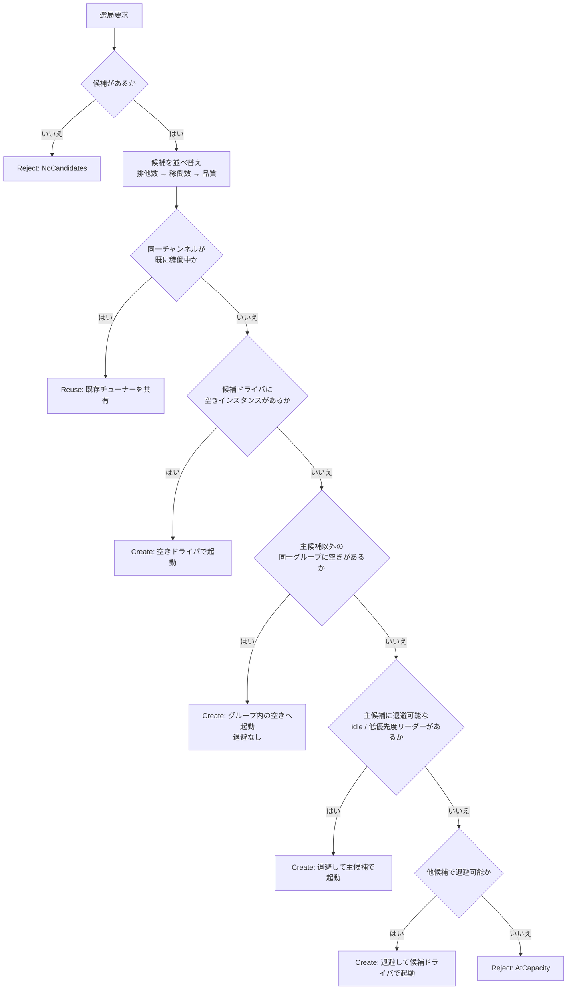
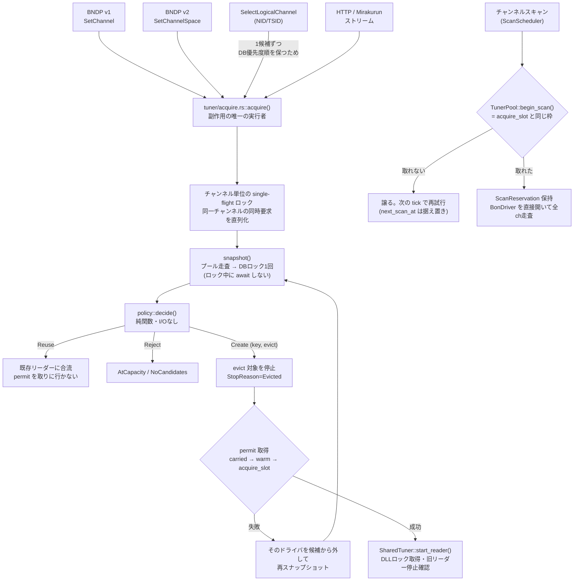
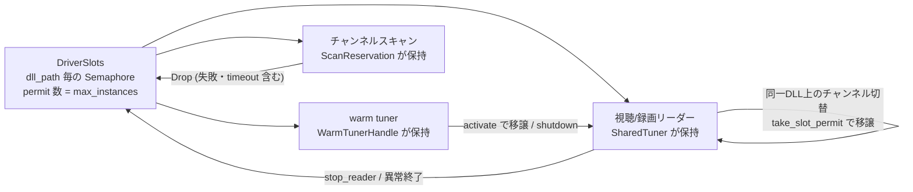
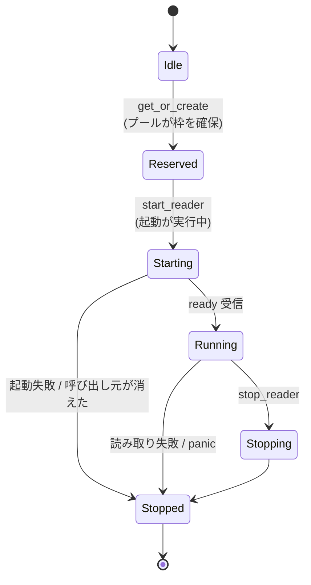
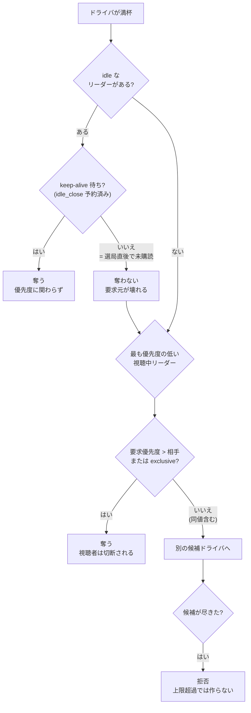
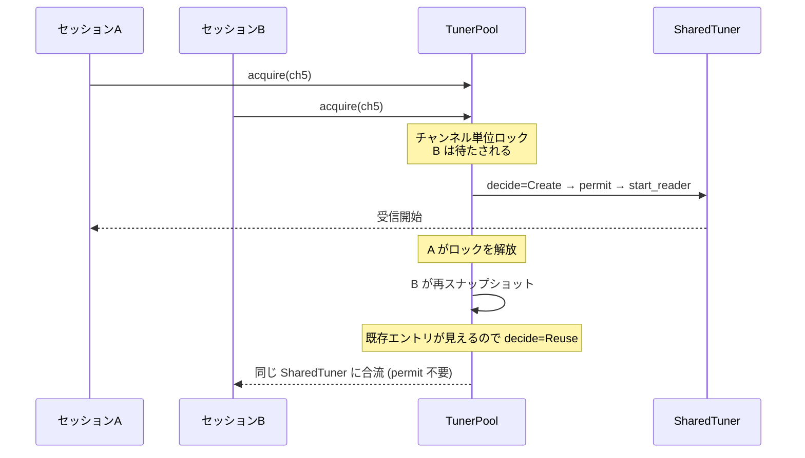
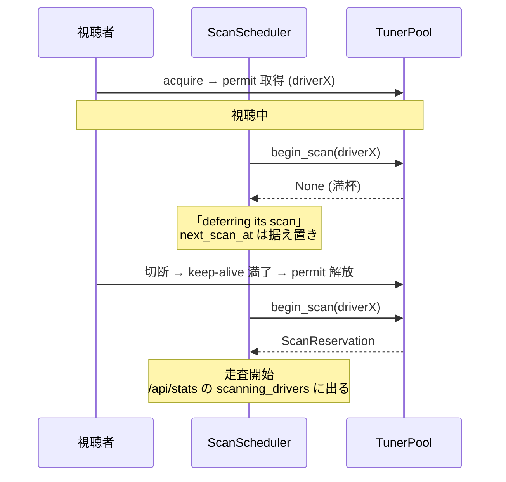

# recisdb-proxy 設計マスタ

**このファイルがプロジェクト設計の正本(Single Source of Truth)。**
実装と食い違いを見つけたら、実装を直すかこのファイルを直すこと。
時点レポート(進捗・修正記録)は [archive/](archive/) にあり、正本ではない。

- 現状の課題と改善計画: [REVIEW_2026-07.md](REVIEW_2026-07.md)
- 利用者向けガイド: [QUICKSTART.md](QUICKSTART.md) / [WEB_DASHBOARD.md](WEB_DASHBOARD.md) / [LOGGING.md](LOGGING.md)
- CLI (recisdb-rs) の内部設計: [ARCHITECTURE.md](ARCHITECTURE.md)

最終更新: 2026-07-02

---

## 1. 目的と全体像

recisdb-proxy は、Windows/Linux 上の TV チューナー (BonDriver / キャラクタデバイス) をネットワーク越しに
複数クライアント (TVTest 等) へ共有するプロキシサーバー。同一チャンネルの視聴を 1 本のチューナーに合流させ、
優先度・排他制御で録画を保護し、チャンネル情報を SQLite に自動スキャン・蓄積する。

```
┌──────────────┐   BNDP/TCP    ┌──────────────────────────── recisdb-proxy ─┐
│ TVTest        │◀────────────▶│ Listener ─ Session ─┬─ TunerPool           │
│ +BonDriver_   │  (40070)     │   (per-client task)  │   └ SharedTuner ──▶ BonDriver DLL /
│  NetworkProxy │              │                      │      (broadcast)     キャラクタデバイス
└──────────────┘              │                      ├─ Database (SQLite)  │
┌──────────────┐   HTTP       │ Web (axum) ──────────┤─ ScanScheduler      │
│ ブラウザ       │◀────────────▶│   (40080)            ├─ AlertManager       │
└──────────────┘              │                      └─ PassiveScanner     │
                              └──────────────────────────────────────────────┘
```

### 設計原則

1. **配信経路を最優先** — TS データパスに同期 I/O・ロック競合・コピーを持ち込まない。
   制御メッセージと TS データは書き込みチャネルを分離し、TS は満杯時に最古を捨てる (遅延より欠落を選ぶ)。
2. **チャンネル切替は BonDriverProxy(Ex) 互換の応答性** — SetChannel を DLL が受理したら即 ACK。
   シグナル待ちで ACK を遅らせない (連続切替で ReadTimeout を誘発するため)。
3. **状態の正はサーバー** — クライアント DLL は薄く、チャンネル定義・優先度既定・容量制限はサーバー側 DB が持つ。
4. **設定は 3 層** — CLI 引数 > TOML ファイル > DB (実行時変更可能なチューニング値)。

---

## 2. ワークスペース構成

| クレート | 役割 | 実行形態 |
|---|---|---|
| `recisdb-proxy` | プロキシサーバー本体 + `recisdb-proxy-setup` (対話式初期設定) | バイナリ ×2 |
| `bondriver-proxy-client` | クライアント DLL (`BonDriver_NetworkProxy.dll`) | cdylib (Windows) |
| `recisdb-protocol` | ワイヤプロトコル定義 (型・コーデック・NID 分類) | lib (no tokio 依存) |
| `recisdb-rs` | CLI チューナーツール (recpt1 代替)。プロキシからは独立 | バイナリ |
| `b25-sys` | ARIB STD-B25 デコード FFI。プロキシ・CLI 双方が使用 | lib |

依存方向: `recisdb-proxy` → `recisdb-protocol`, `b25-sys` / `bondriver-proxy-client` → `recisdb-protocol`。
`recisdb-proxy` は `recisdb-rs` に依存しない (チューナーアクセスは `src/bondriver/{windows,unix}.rs` に自前実装)。

### 非同期方針

- サーバー: tokio マルチスレッドランタイム。BonDriver DLL は `Send` 非対応のため
  **`spawn_blocking` 内で開いて読み取りループごと閉じ込める** (SharedTuner)。
- クライアント DLL: TVTest の同期呼び出しに応えるため、内部に小さな tokio ランタイムを持ち、
  FFI 境界は `std::sync` (parking_lot / Condvar / mpsc) で同期化する。DLL 内で async を���に出さない。

---

## 3. プロトコル (BNDP)

定義: `recisdb-protocol/src/{types,codec}.rs`

### フレーム

```
+--------+----------+---------+------------------+
| Magic  | Length   | Type    | Payload          |
| "BNDP" | u32 LE   | u16 LE  | (可変)           |
+--------+----------+---------+------------------+
  4B       4B         2B        Length バイト
```

- ヘッダ 10 バイト、最大フレーム 16MB (`MAX_FRAME_SIZE`)。超過・Magic 不一致はプロトコルエラー。
- 数値はすべて LE。文字列は `u16 LE 長 + UTF-8`。

### メッセージ (ClientMessage → ServerMessage)

| 系 | Client → Server | Server → Client | 備考 |
|---|---|---|---|
| ハンドシェイク | `Hello{version}` / `Ping` | `HelloAck` / `Pong` | **認証なし (既知の課題 → REVIEW S3)** |
| チューナー | `OpenTuner{path}` / `OpenTunerWithGroup{group}` / `CloseTuner` | `OpenTunerAck{bondriver_version}` 他 | グループ指定時はサーバーがドライバー自動選択 |
| 選局 | `SetChannel{ch,priority,exclusive}` (v1) / `SetChannelSpace{space,ch,priority,exclusive}` (v2) / `SetChannelSpaceInGroup{...}` / `SelectLogicalChannel{nid,tsid,sid?}` | 各 Ack | priority=0 は DB 既定を使用。exclusive は i32::MAX 扱い |
| 列挙 | `EnumTuningSpace` / `EnumChannelName` / `GetChannelList{filter}` | 各 Ack | 列挙は DB の仮想空間 (SpaceGenerator) を返す |
| ストリーム | `StartStream` / `StopStream` / `PurgeStream` / `SetServiceFilter{single_service}` | `TsData{data}` ほか | TsData のみ高頻度。サービスフィルタで単一 SID 配信 |
| その他 | `GetSignalLevel` / `SetLnbPower` | 各 Ack / `Error{code,msg}` | |

**互換性ポリシー**: `MessageType` の値は追加のみ・変更禁止。ペイロード拡張は新バリアント追加で行い、
`Hello.version` でネゴシエーションする (現在 v1)。

---

## 4. サーバー設計 (recisdb-proxy)

### 4.1 モジュールマップ

```
src/
├ main.rs            起動・設定マージ・各サブシステム spawn
├ server/
│  ├ listener.rs     accept ループ、セッション毎に read/write 分離、writer タスク
│  ├ session.rs      ステートマシンとメッセージハンドラ
│  ├ session_capacity.rs / session_driver_selection.rs  容量・候補選択
│  ├ session_runtime.rs / session_space_cache.rs         runtime・空間キャッシュ
│  └ session_tuner_handoff.rs / session_channel_candidates.rs 引き継ぎ・候補集約
├ tuner/
│  ├ pool.rs         TunerPool: ChannelKey → SharedTuner、keep-alive/idle-close
│  ├ shared.rs       SharedTuner: spawn_blocking 読み取りループ + broadcast 配信
│  ├ selector.rs     スコアベースのチューナー候補選択 (信号/負荷/優先度の重み付け)
│  ├ group_space.rs  グループ統合ビュー (GroupSpaceInfo)
│  ├ space_generator.rs 仮想チューナー空間の自動生成
│  ├ lock.rs / channel_key.rs / passive_scanner.rs / logo_collector.rs / ts_parser.rs
├ bondriver/         windows.rs (DLL FFI) / unix.rs (キャラクタデバイス)
├ scheduler/scan_scheduler.rs  定期チャンネルスキャン
├ ts_analyzer/       PAT/PMT/SDT/NIT 解析、service_filter
├ database/          rusqlite ラッパー (schema.rs が正)
├ web/               axum: JSON/SSE API + 埋め込みVueダッシュボード / state.rs (SessionRegistry)
├ service/           OSサービス登録・制御 (systemd / launchd / Windows SCM) → §4.10
├ alert.rs           しきい値監視 + Webhook 通知 (feature "webhook")
└ logging.rs         tracing-subscriber: コンソール + 日次ローテーションファイル

実メトリクスは `web/state.rs` の `SessionMetricsHistory` が保持する。旧 `metrics.rs` は削除済み。
```

### 4.2 セッションのステートマシン

```
Initial ─Hello/HelloAck→ Ready ─OpenTuner→ TunerOpen ─StartStream→ Streaming
                            ▲                  │  ▲                    │
                            └──CloseTuner──────┘  └────StopStream──────┘
                切断/エラー → Closing (unsubscribe → idle-close スケジュール)
```

- セッションは **単一 async タスク**。`SetChannelSpace` 等の処理中は他メッセージを処理しない (直列)。
  そのため選局経路のブロッキング時間が短いことがプロトコル全体の応答性を決める。
- ソケット書き込みは専用 writer タスクに分離。チャネルは 2 本:
  - 制御: bounded + `send().await` (低頻度・損失不可)
  - TS: bounded + `try_send` (満杯時は最古を破棄。TCP 輻輳でセッションループを止めない)

### 4.3 チューナー共有 (TunerPool / SharedTuner)

- `ChannelKey = (tuner_path, ChannelKeySpec)`。同一チャンネル要求は既存 SharedTuner に**合流** (subscriber += 1)。
- SharedTuner は `tokio::sync::broadcast` で TS チャンクを全購読者へ配布。
  読み取りループは `spawn_blocking` 内 (BonDriver が Send 非対応のため)。
- **購読は RAII**: `subscribe()` が返す `TunerSubscription` の `Drop` で購読数が減る。
  手動 `unsubscribe()` は廃止。エンコーダ等の寄生的な消費者は
  `subscribe_untracked()` (`UntrackedSubscription`) を使い、購読数に計上しない。
- **リーダーの状態機械**: `ReaderState = Idle | Reserved | Starting | Running | Stopping | Stopped`。
  `Reserved` (プールが entry を作ったが起動はまだ) と `Starting` (起動実行中) を分けているのは、
  「リーダーを起動すべきか」の判定がこの 2 つを混ぜると必ず誤る (起動をサボるか、
  他タスクの起動に重ねて二重オープンするか) ため。導出述語:
  - `occupies_slot()` … Reserved/Starting/Running/Stopping。容量計上・prewarm 抑止
  - `needs_reader_start()` … Starting/Running 以外。リーダー起動の要否
  - `is_reclaimable()` … (Idle/Stopped) かつ購読者なし。**プール内部**の stale 掃除
  - `is_orphanable()` … Starting/Running 以外かつ購読者なし。**entry 所有者**による返却
- **停止の理由**: `StopReason = Unspecified | Evicted | ReaderFailed | Released` を停止の起点で記録し、
  状態変化は `tokio::sync::watch` で配信する。セッションは自分のチューナーの状態を購読し、
  退避やドライバ障害を即座に検知して理由付きで切断する (旧: 2 秒周期のポーリング)。
- **keep-alive**: subscriber が 0 になっても `keep_alive_secs` (既定 60s、DB `tuner_config` で変更可) は
  リーダーを維持し、ザッピング戻りを即応させる。`cancel_idle_close()` で復帰。
- **prewarm**: OpenTuner 時に DLL に空きスロットがあればウォームチューナーを起動して初回選局を高速化。
  warm ハンドルもスロット permit を保持する (開いている以上、容量を占有しているため)。
- **SI 収集は別タスク**: SDT/CDT (ロゴ) と EIT (EPG) の収集は、クライアントと同じ broadcast を
  購読する専用タスク (`spawn_si_collector`) が行う。読み取りスレッド上では走らせない。
- **選局シーケンス (Round 3 確定仕様)**: `SetChannel → Purge → 短い sleep → ACK 送信 → (シグナルはログのみ)`。
  シグナルロック待ちで ACK を遅らせてはならない。停止応答は `wait_ts_stream(100ms)`、stop_reader タイムアウト 1s。
  これらの時定数は `tuner/timing.rs` に集約 (docs/TUNER_PIPELINE_REDESIGN.md P2a)。
- **リーダー起動 API**: cold open (新規 BonDriver オープン) と warm 起動 (prewarm 済みハンドルの
  活性化) は `SharedTuner::start_reader(tuner_pool, tuner_path, space, channel, startup_config,
  permit, warm: Option<WarmTunerHandle>)` に一本化 (docs/TUNER_PIPELINE_REDESIGN.md P2a)。
  DLL 初期化ロックの取得・既存リーダー停止の確認・スロット permit の格納は全てこの関数内で完結し、
  呼び出し元 (`session.rs` / `channel_resolve.rs`) はここを呼ぶだけでよい。
  ready 待ちのタイムアウトは `set_channel_retry_timeout_ms + 5000ms` (`tuner/timing.rs` の
  `reader_ready_timeout`) から算出し、SetChannel 再試行の予算より必ず長くする —
  ready 側が先にタイムアウトして立ち去ると、後から SetChannel に成功したリーダーが
  誰にも参照されないまま DLL スロットを占有し続ける (孤児リーダー) ため。
  リーダー側も `ready_tx.send()` の戻り値を見て、送信失敗 (= 呼び出し元が待ちをあきらめた) なら
  読み取りループへ入らずその場でスロットを解放して終了する。

### 4.4 選局ポリシー (優先度・排他・容量)

**決定は純関数、副作用は executor 1 箇所** (docs/TUNER_PIPELINE_REDESIGN.md)。

```
TuneRequest ─→ tuner/policy.rs::decide(TunerSnapshot, req) ─→ Decision
                                                                 │
                                          tuner/acquire.rs::acquire() が実行
                                                                 │
        SetChannel(v1) / SetChannelSpace / SelectLogical / HTTP・Mirakurun
```

- `decide()` は I/O も async もログも持たない純関数。プールと DB の状態を
  **1 回だけ**スナップショットし、以降の判断はそれだけを見る。
- `acquire()` が `Decision` を実行する唯一の場所 (予約取得・退避・リーダー起動)。
  スナップショットが古くなっていた場合は新しいスナップショットで `decide` からやり直す (上限 3 回)。
- 選局 4 経路はすべて `acquire()` を通る。各経路は「要求の組み立て」と
  「成功後のメタデータ適用」だけを持つ。**新しい選局経路を session/web に直接書かない。**

**優先度**: `exclusive=true → i32::MAX` > `クライアント指定 (>0)` > `channels.priority (DB)` > `0`。
目安は 録画(排他)=255 / 録画=200 / 視聴=10 / スキャン=0。
**サーバー側でクライアント申告値を制限する仕組みは未実装 (REVIEW S3)。**

**容量**: `bon_drivers.max_instances` が DLL 毎の同時チャンネル数上限。
数えるのではなく**取る** — `TunerPool::acquire_slot(dll_path, max_instances)` が返す
`SlotPermit` を持たないとリーダーを起動できない (型で強制)。permit は
`SharedTuner` が保持し、`stop_reader` とリーダーの全異常終了経路で明示的に解放する。
満杯なら待たずに `None` を返し、退避・フォールバック・失敗の判断は呼び出し元に残す。

**同一 DLL 上のチャンネル切り替えは permit を移譲する。** 旧リーダーは切り替え成功まで
停止されないため、`max_instances=1` では「解放してから取得」も「取得してから解放」も成立しない。

**退避規則** (`policy::decide_at_capacity`、全経路共通):

1. 同一グループの別ドライバに空きインスタンスがあれば、そこへ作成
2. それが無ければ、そのドライバの **idle** (購読者なし) リーダー
3. idle が居なければ**購読者のいるリーダー**でも最も優先度の低いもの
4. どれも退避できなければ別の候補ドライバの退避を試す
5. それでも駄目なら拒否

1・2 の可否は `may_evict = 要求優先度 > 相手の優先度 || exclusive`。
**同値では奪わない**。`exclusive` はハードウェアそのものの要求なのでタイに勝つ。
**`max_instances` を超えて作ることはない** — 上限はハードウェアの事実なので、
超過するくらいなら稼働中のリーダーを停止して作り直す。

その結果、優先度が上回る要求 (例: 録画 200 が視聴 10 を退避) で**視聴中のセッションが
切断され得る**。退避された側は状態 watch で即座に検知し、理由 (`Evicted`) を
ログとセッション履歴に残して切断する。クライアントへのプロトコル通知は未実装。

#### 選局先の決定フロー

`tuner::policy::decide` は、排他要求かどうかで別の選択経路へ分岐せず、同じ候補順序と
容量判定を使う。候補は単一チューナーなら1件、グループなら同じ論理チャンネルを提供する
全ドライバから作られる。



同一グループに空きがある場合は、要求が排他であっても主候補のリーダーを先に退避しない。
`max_instances` はドライバごとの上限として常に守り、候補がすべて満杯のときだけ優先度と
`exclusive` による退避判定へ進む。

### 4.4.1 図解: チューナーを取り合う全経路

実機検証 (`docs/TUNER_PIPELINE_REDESIGN.md` §4.5〜§4.6) で確定した挙動を図にする。

#### 誰がチューナーを要求し、どこで一本化されるか



要点:

- 選局 4 経路はすべて `acquire()` を通る。**新しい選局経路をここを迂回して書かない。**
- スキャンは `acquire()` は通らない (プールのエントリを作らず自前で全 ch を走査する) が、
  **スロット予約だけは同じ枠を通す**。だから視聴とスキャンが同じドライバを取り合わない。
- `SelectLogicalChannel` だけは候補を 1 件ずつ渡す。この経路の候補順 (DB 優先度) に
  意味があり、`decide()` の並べ替えで潰したくないため。

#### スロットの持ち主

`max_instances` はハードウェアの事実なので、超過は選択肢にしない。「数える」のではなく
`SlotPermit` を「取る」。



移譲が要る理由: 旧リーダーは切り替え成功まで止めないので、`max_instances=1` では
「解放してから取得」も「取得してから解放」も成立しない。

#### リーダーの状態



| 述語 | 真になる状態 | 用途 |
|---|---|---|
| `occupies_slot()` | Reserved / Starting / Running / Stopping | 容量計上・prewarm 抑止 |
| `needs_reader_start()` | Starting / Running **以外** | リーダー起動の要否 |
| `is_reclaimable()` | (Idle / Stopped) かつ購読者なし | **プール内部**の stale 掃除 |
| `is_orphanable()` | Starting / Running 以外 かつ購読者なし | **所有者**による返却 |

`Reserved` と `Starting` を分けないと「起動すべきか」の判定が必ず誤る
(起動をサボる、または他タスクの起動に重ねて二重オープンする)。

#### 満杯のときに誰を退避するか



- **同値では奪わない。** 同順位が先着を蹴散らしても得るものがない。
- **`exclusive` はタイに勝つ。** ハードウェアそのものを要求しているため。
- **keep-alive の残骸は優先度に関わらず譲る。** 誰も見ていないため。ただし
  「購読者ゼロ」だけで判断してはいけない ―― `SetChannelSpace` と `StartStream` の
  間のエントリも購読者ゼロで、これを奪うと要求元が壊れる。

#### 同時に同じチャンネルが要求されたとき



直列化していないと、両者とも「合流先なし」と判断して別々のドライバに 1 本ずつ開く。
チューナーは有限なので、これは実害のある無駄遣いになる。

#### スキャンと視聴の競合



スキャンは最も優先度の低い作業なので、退避はせず待つ。逆に走査中はそのドライバが
満杯として扱われ、視聴要求は別ドライバへ回る。

### 4.5 グループ選局と仮想チューナー空間

- `bon_drivers.group_name` (DLL 名から自動推測、例: BonDriver_MLT1.dll → "PX-MLT") で複数 DLL を束ねる。
- `SpaceGenerator` がチャンネル DB から仮想空間を生成:
  地上波(都道府県毎に分割) → BS → CS → 4K → その他 の順で空間を割当て、存在しない帯域は詰める。
  帯域は `BandType::from_nid()`、都道府県は `get_prefecture_name(nid)` (TVTest 互換) で判定。
- `GroupSpaceInfo` がグループ内全ドライバーの空間を統合し、`(仮想space, ch)` → 配信可能ドライバー群を解決。
  同じ (NID, TSID) を持つ候補ドライバー群は `acquire()` にまとめて渡され、
  `decide()` が「排他チャンネル数 → 稼働インスタンス数 → 品質スコア」の順で並べ替えて選ぶ。
  既に同じ物理チャンネルを稼働中のドライバーがあれば最優先で合流する。
  グループ内でチャンネル可用性がドライバー毎に異なることは仕様として許容 (ベストエフォート)。
- ただし `SelectLogicalChannel` の候補は DB 優先度順 (`get_channels_by_nid_tsid_ordered`) に
  意味があるため、この経路だけは外側でループし 1 候補ずつ `acquire()` を呼ぶ。
  順序規則の統一は未着手。

### 4.6 チャンネルスキャン

- **ScanScheduler**: `bon_drivers.next_scan_at` を定期チェック (既定 60s) し、期限が来たドライバーを
  スキャン優先度順に実行 (同時実行数上限あり、既定 1)。チューナー使用中は譲る (scan priority=0)。
- **ts_analyzer**: PAT→SDT→NIT を解析し NID/SID/TSID・サービス名・物理 ch・リモコンキーを取得、
  `channels` に upsert。ARIB 文字は `aribb24` ラッパーでデコード (Linux の文字化け対応済み)。
- **logo_collector**: 配信中 TS からロゴ (CDT) を収集し Web `/logos/:file` で配信。
- **nit_collector** (2026-08-14): 配信中 TS の NIT (PID 0x0010) から、スキャンなら入るはずの
  `channels.remote_control_key` / `physical_ch` / `network_name` を拾い、**NULL の列だけ**埋める
  (`tuner/nit_collector.rs` → `nit_writer.rs` → `Database::fill_missing_terrestrial_metadata`)。
  対象は CSV インポート・`POST /api/channels` で手動登録した行 — その 2 経路はこれらを NULL 固定で
  INSERT するため、スキャンを回さない共有チューナー構成ではリモコンキーが永久に埋まらず、
  EPGStation の番組表・放映中で当該局が末尾に固まっていた (`docs/EPGSTATION_COMPAT.md` §5.4)。
  既存値は `COALESCE` で温存する (スキャン結果が常に優先)。照合は networkId 単位で、衛星は対象外。
- `bon_drivers.passive_scan_enabled` は DB 列と設定 UI だけが残っており、**参照する実装は無い**。
  上記 2 つのコレクタはこのフラグを見ずに常時動く。

### 4.7 Web ダッシュボード / API

- axum。`/` に埋め込みVueダッシュボード (`web-ui/` を Vite ビルドして `rust-embed` で同梱)、`/api/*` に JSON API、`/api/events` にSSE更新イベント。
- **クライアント一覧は BNDP と HTTP の両方を載せる (2026-08-14)**。`SessionRegistry` へ登録するのは
  かつて BNDP セッション (`server/listener.rs`) だけで、HTTP 経由の視聴 —
  ダッシュボードのプレビュー、および Mirakurun 互換 API 経由の EPGStation の視聴・録画 — は
  チューナーを占有しながら一覧に出なかった (「チューナーが埋まっている理由は必ず画面に出す」に反する)。
  HTTP 側は `web/http_session.rs` の `HttpStreamSession` が RAII で登録・解除する
  (`StreamCleanup` が保持し、レスポンスボディの破棄 = 切断で解除)。
  - `SessionInfo.protocol` (`bndp` / `http` / `mirakurun`) で経路が分かる。UI の「接続方式」列
  - **セッション id は `SessionRegistry::allocate_id()` が全経路へ払い出す**。BNDP が自前で
    connection_count を数えていたままだと HTTP と衝突する (同じ map・同じ切断 API を共有するため)
  - `POST /api/clients/{id}/disconnect` は HTTP セッションにも効く。受け取った body ストリームは
    そこで終了する (`web/stream.rs` の `shutdown_rx`)
  - 統計は送信バイトから 1 秒に 1 回だけ反映する (`packets_sent` / ビットレート)。信号レベルと
    ドロップ数は BNDP のような per-client の送信キューが無いため既定値のまま
- 主なリソース: tuners / bondrivers (CRUD+scan+品質) / channels (CRUD+import/export+batch) /
  clients (品質・履歴・切断・制御) / session-history / alert-rules / scan-config / tuner-config / tsreplace-config /
  encode-profiles (CRUD、STREAMING_DESIGN.md §5.3 P5) / stream (HTTP-TS 配信、§6.3 P5) /
  service (OSサービスの状態取得とサーバー再起動、§4.10)。
- **HTTP-TS ストリーミング (実装済み・2026-07-04, STREAMING_DESIGN.md §6.3/§7.2 P5)**:
  `GET /api/stream/service/:sid` (生 TS passthrough) / `GET /api/stream/service/:sid?profile=preview`
  (`encode_profiles` の `purpose='preview'` 行 + 共有エンコーダプール (§4.8/P4) で H.264 変換した TS)。
  `:sid` は `channels.id` (既存 `/api/channel/:id` 系と同じ主キー)。選局は `server/channel_resolve.rs`
  (session.rs の単一チューナーモード相当を切り出した専用ヘルパー。グループ選局・排他退避・容量フォールバックは
  意図的に含まない — 詳細と理由はそのモジュールの doc comment) で解決し、`TunerPool`/`SharedTuner`/
  `EncoderPool` は session.rs と共有・合流する。クライアント切断時は `axum::body::Body::from_stream` の
  ドロップを契機にチューナー購読解除 (`SharedTuner::unsubscribe` + `TunerPool::schedule_idle_close`) と
  エンコーダ購読解除 (`EncoderPool::release`) を行う (`web/stream.rs::StreamCleanup`)。
  `/api/*` と同じ Bearer 認証下 (§6.5)。
- **エンコードプロファイル (実装済み・2026-07-04, STREAMING_DESIGN.md §5.3/§9 P5)**: `encode_profiles` テーブル
  (`purpose`: record/preview/view、`codec`/`container`/`target_bitrate`/`extra_args`)。起動時に
  `preview-h264` (H.264, ~2Mbps) を未存在なら自動シード。`command_path` はこのテーブルにもリクエスト型にも
  存在しない — 引き続き `tsreplace_config.command_path` (TOML専用、REVIEW S1) のみが実行コマンドを決める。
- **認証 (実装済み・2026-07-04, REVIEW S2)**: `/api/*` は `Authorization: Bearer <token>` 必須
  (`web/auth.rs::require_auth`、`axum::middleware::from_fn_with_state` で `/api` 配下のみに適用)。
  `GET /` (ダッシュボード HTML 本体) と `/logos/:file`、`/static/vue/*` は無認証のまま (トークン入力 UI と静的資産読込のため)。
  トークンは起動時に TOML `[web] auth_token` > DB (`web_auth_config` テーブル、単一行) > 新規生成 の順で解決し、
  新規生成時のみ起動ログに一度だけ表示する。`[web] auth_enabled = false` で無効化可能 (無効時は起動時に WARN)。
  Vue側は初回入力したトークンを `localStorage` に保存し、APIクライアントが全 `/api/*` 呼び出しと `/api/events` のSSE接続へ自動付与する。
- **CORS**: `CorsLayer::permissive()` は廃止し、CORS レイヤー自体を外した (ダッシュボードは同一オリジン配信のため
  ブラウザの同一オリジンポリシーで十分。他オリジンからの `fetch` はブラウザ側で拒否される)。
- **既定 bind**: `web_listen` の既定は `127.0.0.1:40080` (REVIEW P0)。LAN 公開は `--web-listen 0.0.0.0:40080` などで明示オプトイン。
- `SessionRegistry` (web/state.rs) がセッションのライブメトリクス
  (signal/drop/scramble/bitrate、5 分の履歴リングバッファ) を保持。セッション終了時に `session_history` へ永続化。
- ダッシュボード更新は `GET /api/events` のSSEを主経路とし、Vue側は接続失敗時のみ 30 秒ポーリングへフォールバックする。
- **ログ閲覧 (「ログ」タブ、`web/api/logs.rs`)**: `logging.rs` の `tracing_subscriber::registry()` に
  第3のレイヤー `logging::LogBufferLayer` を積み、直近5000件を `Arc<LogBuffer>`(`logging/buffer.rs`、
  `std::sync::RwLock<VecDeque<LogEntry>>` + `seq: AtomicU64`)へミラーする。既存の stdout/file
  `fmt::layer()` と同じく `enabled()` を独自に実装しないため、`registry().with(env_filter).with(...)`
  の `EnvFilter` がそのまま効く(`Layered` は全レイヤーの `enabled()` を AND するので、この層に別途
  フィルタは要らない)。`WebState::log_buffer` 経由で `GET /api/logs`(`level`/`target`/`q`/`after_seq`
  によるインクリメンタル取得、`dropped` でリングバッファからの押し出しを通知)と `GET /api/logs/files[/:name]`
  (ローテーション済みファイルの一覧・ダウンロード、パストラバーサル対策としてファイル名を
  `recisdb-proxy.log.*` かつ区切り文字/`..`なしに制限した上で `canonicalize()` して `log_dir` 配下か検証)
  を提供する。フロントエンドは2秒間隔ポーリング(SSEはデータを載せない設計のため不採用)。

- **Mirakurun 互換 API サブセット (実装済み・2026-07-04, STREAMING_DESIGN.md §7.1 P6)**:
  `web/mirakurun.rs`。`GET /version` / `GET /status` / `GET /channels` / `GET /services` /
  `GET /services/:id/stream` / `GET /channels/:type/:channel/stream` を **`/mirakurun/api/*`**
  という別ルータにマウント (`web/mod.rs::build_mirakurun_router`)。**`/api/*` の `require_auth` は掛からない**
  (実 Mirakurun クライアント — EPGStation/mirakc/KonomiTV — は `Authorization` ヘッダを送らないため、
  既存の認証必須 `/api/*` 配下に置くと利用できない)。そのため **既定 disabled の opt-in**
  (`[mirakurun] enabled = false`、`main.rs::MirakurunSection`)。有効化時は
  `web::start_web_server` が起動時に一度 WARN ログを出す (「無認証で配信される、信頼ネットワーク/
  localhost のみで公開せよ」)。`web_listen` の既定 `127.0.0.1` と合わせて二重に既定安全。
  EPG (`/api/programs` 等) は対象外 (視聴系のサブセットのみ)。
  サービス id は Mirakurun 慣例 `networkId * 100000 + serviceId`
  (`mirakurun_service_id`/`split_mirakurun_service_id`、往復をユニットテスト)。
  `band_type` → Mirakurun `type` は `Terrestrial→GR / BS→BS / CS→CS / FourK→BS(4K相当の型がないため) /
  CATV→GR / SKY・Other→SKY` という簡略化 (`band_type_to_mirakurun`)。
  ストリーム系ハンドラは `server/channel_resolve.rs`(新設 `resolve_service_by_nid_sid`)で
  `(nid, sid)` → `channels` 行を解決し、`web/stream.rs` の P5 配信基盤
  (`StreamCleanup`/`broadcast_to_body_stream`/`respond_with_stream`。これらは `pub(crate)` 化して共有)
  をそのまま再利用した生 TS passthrough (`?profile=` 等の変換は非対応)。
  **実機 BonDriver・実 Mirakurun クライアントでの動作検証はできていない** (この環境の制約、
  STREAMING_DESIGN.md §11 P6 実装メモ参照)。

### 4.8 tsreplace (外部エンコーダ) パイプ

- `tsreplace_config` の設定でセッションの TS を外部コマンド (既定: tsreplace + QSVEncC) に通してから配信できる。
- stdin/stdout パイプ、stderr はログへ。エラー時 passthrough 可 (`passthrough_on_error`)。
- **`command_path` は API/DB から変更不可 (実装済み・2026-07-04, REVIEW S1)**: `command_path` は
  `Command::new(command_path)` で直接実行されるため信頼境界そのもの。`POST /api/tsreplace-config`
  (`UpdateTsreplaceConfigRequest`) にはフィールド自体が存在せず、送っても無視され既存値が維持される。
  変更できるのは起動時の TOML `[tsreplace] command_path` のみ (`Database::set_tsreplace_command_path`、
  main.rs から一度だけ呼ばれる)。`arguments`/`enabled`/`read_timeout_ms`/`passthrough_on_error`/
  `max_concurrent_encoders` は従来どおり API から変更可能。ダッシュボードのフォームも実行コマンド欄を
  読み取り専用表示に変更済み。

### 4.9 アラート

- `alert_rules` (metric: drop_rate/scramble_rate/error_rate/signal_level/bitrate、条件 gt/lt/gte/lte) を
  5 秒周期で全セッションに対して評価。発火/解消を `alert_history` に記録、`webhook_url` へ通知
  (feature `webhook`、generic/Discord 等 format 指定)。

### 4.10 OSサービス登録 (service/)

- 目的: インストール時にサーバーをOSのサービスとして登録し、PC起動時に自動で開始する。サービス名は
  セットアップウィザードのGUIから指定できる (既定 `recisdb-proxy`)。
- 構成:
  - `service/mod.rs` — プラットフォーム非依存の公開API (`ServiceSpec` / `ServiceStatus` /
    `install` / `uninstall` / `start` / `stop` / `restart` / `status`) と、各OSモジュールへのディスパッチ。
  - `service/unit_text.rs` — systemd unit と launchd plist の**文字列生成のみ**を行う純関数群
    (`cfg(target_os)` を持たないのでどのOSでもテストできる)。
  - `service/systemd.rs` (Linux) / `service/launchd.rs` (macOS) / `service/windows_scm.rs` (Windows)
    — 実際のファイル配置とコマンド実行 (`systemctl` / `launchctl` / SCM API)。
  - `service/restart.rs` — 自プロセスの再起動 (下記)。
  - `service_cli.rs` (バイナリ専用) — `recisdb-proxy service <action>` サブコマンド。
- **サービス名のサニタイズ**: 名前は `systemctl`/`launchctl`/`sc.exe` の引数やファイルパスに埋め込まれるため、
  `sanitize_service_name` が `[A-Za-z0-9._-]` のみ・1〜64文字・先頭は英数字・`..` を含まない、に制限する。
  コマンドはすべて `Command::new(...).arg(...)` で組み立て、シェルを経由しない。
- **スコープ**: `System` (既定、root/管理者権限が必要) と `User` (`systemctl --user` / LaunchAgents)。
  Windows の SCM にユーザースコープの概念はないため `ServiceScope::User` は常に `NotSupported`。
- **サービスとして起動されたかの判定**: サービス定義には必ず `--run-as-service --service-name <名前>` が
  前置される (`ServiceSpec::service_args`)。プロセスはこのフラグを見て自分がサービスかどうかを確実に判定する。
  環境変数によるヒューリスティック (`INVOCATION_ID`/`JOURNAL_STREAM`/`XPC_SERVICE_NAME`) は、旧バージョンが
  書いた定義のためのフォールバックとしてのみ使う。**親PIDが1かどうかは判定に使わない** —
  バックグラウンド起動で親シェルが終了しただけのプロセスも ppid=1 になり、「再起動」がただの停止になるため。
- **Windows**: SCM に起動されたプロセスは ServiceMain から Running を報告し Stop 制御を受け付ける必要がある
  (さもないと「サービスが応答しませんでした」になる)。`--run-as-service` の場合のみ
  `windows_scm::run_dispatcher` 経由でサーバー本体を起動し、Stop/Shutdown を受けたら
  `main.rs::run_server` の shutdown future を解決して graceful に停止する。SCM は WorkingDirectory を
  持たないので `--service-workdir` を渡して起動時に chdir する。障害時の自動復帰は failure actions
  (5秒後に再起動、3回まで) で設定する。
- **再起動 (`service/restart.rs`)**: 方式はサービス管理下かどうかで変わる。
  - systemd / launchd 配下 — プロセスを終了するだけ。`Restart=always` / `KeepAlive=true` が起こし直す
    (unit を操作しないので root 権限が要らない)。
  - Windows SCM 配下 — 正常終了は SCM にとって障害ではなく failure actions が発火しないため、
    切り離した `cmd` から `sc stop` → `sc start` を実行させる。
  - サービス管理下でない — 従来どおり自分自身を exec し直す (Unix) / 遅延ランチャを撒いて終了する (Windows)。
  自己更新 (`web/api/update.rs`) の最後の再起動もこの共通処理を使う。
- **Web からの操作範囲**: `GET /api/service/status` と `POST /api/service/restart` のみ。登録・削除は
  管理者権限が必要で、任意の実行ファイルをネットワーク越しに常駐登録できると権限昇格の経路になるため、
  セットアップウィザードと CLI からのみ行う。
- **SIGTERM**: `systemctl stop` / `launchctl bootout` は SIGTERM を送る。`main.rs::shutdown_signal` が
  Ctrl+C と SIGTERM の両方を待つ (以前は Ctrl+C のみで、SIGTERM は既定動作で即死していた)。

---

## 5. クライアント DLL 設計 (bondriver-proxy-client)

```
src/
├ lib.rs              CreateBonDriver (catch_unwind 済み、呼ぶたびに新インスタンス)
├ bondriver/
│  ├ interface.rs     IBonDriver/2/3 vtable (RTTI 対応)
│  └ exports.rs       各エクスポートの実装
├ client/
│  ├ connection.rs    TCP 接続・RPC (std::sync::mpsc + recv_timeout)・再接続
│  └ buffer.rs        TsRingBuffer (Condvar 通知、ポーリングなし)
└ config.rs           INI (BonDriver_NetworkProxy.ini) + 環境変数
```

- **インスタンス独立性 (不変条件)**: `CreateBonDriver()` は呼ばれるたびに独立したインスタンスを返す。
  接続 (`Connection`)・リングバッファ・現在の space/channel はインスタンスごとに持ち、プロセス共有の
  シングルトンにしてはならない。ホストは同一 DLL から複数のオブジェクトを作る
  (**多段構成: 上流 recisdb-proxy が `max_instances > 1` の BonDriver として本 DLL を開く場合**、
  および EDCB の複数チューナー)。共有すると 2 つの読み手が同じリングバッファから
  互いのバイトを奪い、TS が寸断されて Drop / Error / Scramble として観測される。
  各エクスポートは `this` ポインタから自分のインスタンスを解決する
  (生存インスタンス集合で検証 → null/解放済みポインタでも UB にならない)。`Release` で破棄する。
- **同期化の要**: TVTest からの呼び出しはすべて同期。RPC は `send_request_with_timeout()` で
  必ずタイムアウトを持つ (UI フリーズ防止)。`WaitTsStream` は `buffer.wait_data()` (Condvar)。
- **ファストパス**: `TsData` はメッセージデコードを迂回してリングバッファへ直行。読みバッファ 256KB。
- **リングバッファの TS 境界**: 消費側の resync (満杯時に古いデータを捨てて near-live へ復帰) と
  `PurgeStream` は、どちらも **188 バイト境界と SPSC 契約を壊さない**こと。
  - resync のスキップ量は 188 の倍数に切り下げる。サーバのフレーム長は 188 の倍数とは限らないため、
    切り下げないと `read_pos` がパケット途中に落ち、以降ずっとパケットを跨いだ 188 バイトを返し続ける。
  - `clear()` は `read_pos` を `write_pos` へ進める実装にする。`write_pos` を 0 に戻すと、
    FFI スレッドの `PurgeStream` と受信タスクの `write` が競合し、古い領域が新しい TS として再公開される。
- **キャッシュ**: `GetSignalLevel` は 2 秒 TTL。space/channel 名は上限付きキャッシュ
  (MAX_SPACES=256, MAX_CHANNELS_PER_SPACE=1024 — 不正値による OOM 防止)。
- **防御**: `GetTsStream` は null/サイズ 0/上限超過を検証。パニックは FFI 境界で捕捉
  (現状 CreateBonDriver のみ → 全境界へ拡大予定)。
- INI 主要キー: `Address`, `Priority`, `Exclusive`, `GroupName` (グループ選局), TLS 設定 (feature 時)。

---

## 6. データベース設計 (SQLite)

正: `recisdb-proxy/src/database/schema.rs`。起動時に `IF NOT EXISTS` + `apply_migrations()` で自己構築・自己修復
(band_type/terrestrial_region の NULL 埋め等)。`docs/migrations/*.sql` は参考用スナップショット。

| テーブル | 役割 | 要点 |
|---|---|---|
| `bon_drivers` | DLL 登録・グループ・スキャン設定・容量 | `group_name`, `max_instances`, `auto_scan_enabled`, `scan_interval_hours`, `next_scan_at`, `passive_scan_enabled` |
| `channels` | チャンネル正規化情報 | 一意キー `(bon_driver_id, nid, sid, tsid, manual_sheet)`。`band_type`/`region_id`/`terrestrial_region` は自動判定。`priority` は論理選局の既定優先度、`failure_count` で不良チャンネル追跡 |
| `scan_history` | スキャン実行記録 | 成否・件数・エラー |
| `scan_scheduler_config` / `tuner_config` / `tsreplace_config` | 単一行 (id=1) の実行時設定 | Web API から変更 → 次回参照時に反映 |
| `session_history` | セッション統計の永続化 | drop/scramble/error、平均ビットレート・信号、切断理由 |
| `alert_rules` / `alert_history` | アラート定義と発火記録 | webhook_url/format |
| `driver_quality_stats` | ドライバー個体の品質スコア | `quality_score` 0.0-1.0 (**selector 未接続 — REVIEW 5-5**) |

運用ノート: WAL 未設定・単一コネクション + `tokio::sync::Mutex` (REVIEW 5-1/2 で改善予定)。

---

## 7. 設定レイヤー

優先順位: **CLI 引数 > TOML (`recisdb-proxy.toml`、カレント自動検出) > DB (実行時値) > ハードコード既定**

| 層 | 内容 |
|---|---|
| CLI / TOML | `listen` (既定 **0.0.0.0:40070**), `web_listen` (既定 **127.0.0.1:40080**、2026-07-04 変更。REVIEW P0), `tuner`, `database`, `max_connections` (64), ログ設定, TLS パス, `[web] auth_enabled`/`auth_token`, `[tsreplace] command_path` |
| DB (Web API から変更) | `tuner_config` (keep_alive=60s, prewarm, SetChannel リトライ, signal 待ち), `scan_scheduler_config`, `tsreplace_config` (`command_path` を除く — API からは変更不可), `web_auth_config` (トークン永続化、API からは変更不可・main.rs のみが書き込む) |

TLS 設定 (`[tls]`) は **現状サーバー側で機能しない** (パースのみ、accept 経路未結線)。実装完了までは使用しない。

---

## 8. ロギング / デバッグ

- `tracing-subscriber` + `tracing-appender`: コンソールと `logs/recisdb-proxy.log.YYYY-MM-DD` に二重出力、
  日次ローテーション + `retention_days` で自動削除。ファイル側は ThreadId・ファイル:行番号付き。
- 制御: `-v` / `RUST_LOG` (EnvFilter) / TOML `[logging] level`。詳細は [LOGGING.md](LOGGING.md)。
- クライアント DLL: INI 指定のファイルログ (TVTest プロセス内デバッグ用)。
- 方針: DEBUG=状態遷移、INFO=リソース生成/破棄と選局イベント、WARN=リカバリ可能、ERROR=要対応のみ。

---

## 9. 既知の制約・意図的な未実装 (2026-07 時点)

| 項目 | 状態 |
|---|---|
| サーバー側 TLS | 設定パースのみ。accept 経路に TlsAcceptor 未結線 |
| プロトコル認証 | なし (Hello はバージョンのみ、REVIEW S3 未着手) |
| Web API 認証 | **実装済み (2026-07-04)**: `/api/*` に Bearer トークン認証、CORS はレイヤー自体を撤去、`web_listen` 既定 `127.0.0.1` (REVIEW S2/P0)。プロトコル認証 (S3) は別課題として未着手 |
| 容量制御の場所 | `server/session_capacity.rs` に共通化。`MuxKey` は未使用だったため削除済み |
| メトリクス | `web/state.rs` のセッション履歴リングバッファへ統一。旧 `metrics.rs` は削除済み |
| 統合テスト | なし (単体テストは protocol/db/ts_analyzer/space_generator 等に散在) |
| graceful shutdown | BNDPリスナーとWebサーバーで実装済み |

改善順序は [REVIEW_2026-07.md §7 ロードマップ](REVIEW_2026-07.md) に従う。

---

## 10. ドキュメントマップ

| ファイル | 位置づけ |
|---|---|
| **DESIGN.md** (本書) | 設計の正本 |
| [STREAMING_DESIGN.md](STREAMING_DESIGN.md) | TS 配信・信頼性・固定秒数バッファ・tsreplace 最適化・ブラウザプレビューの設計 |
| [REVIEW_2026-07.md](REVIEW_2026-07.md) | 最新レビュー・改善ロードマップ |
| [QUICKSTART.md](QUICKSTART.md) | 導入手順 (利用者向け) |
| [WEB_DASHBOARD.md](WEB_DASHBOARD.md) | ダッシュボード / API リファレンス (利用者向け) |
| [LOGGING.md](LOGGING.md) | ログ設定リファレンス |
| [ARCHITECTURE.md](ARCHITECTURE.md) | recisdb-rs (CLI) の内部設計 |
| [migrations/](migrations/) | DB スキーマ変更の参考 SQL |
| [archive/](archive/) | 時点レポート (旧計画・実装進捗・修正記録)。正本ではない |
