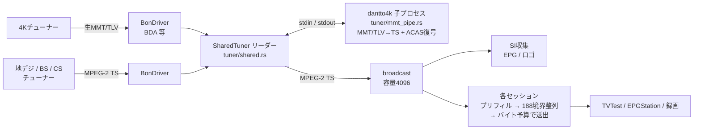
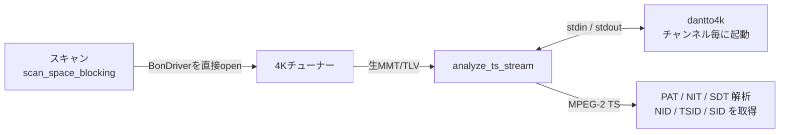
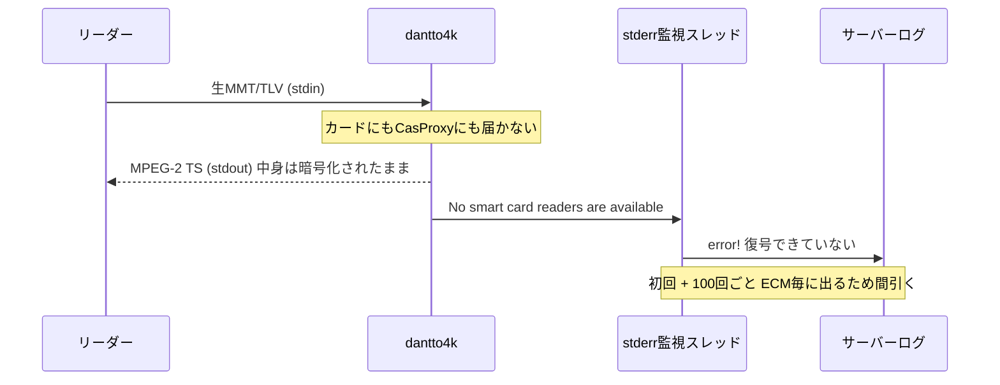
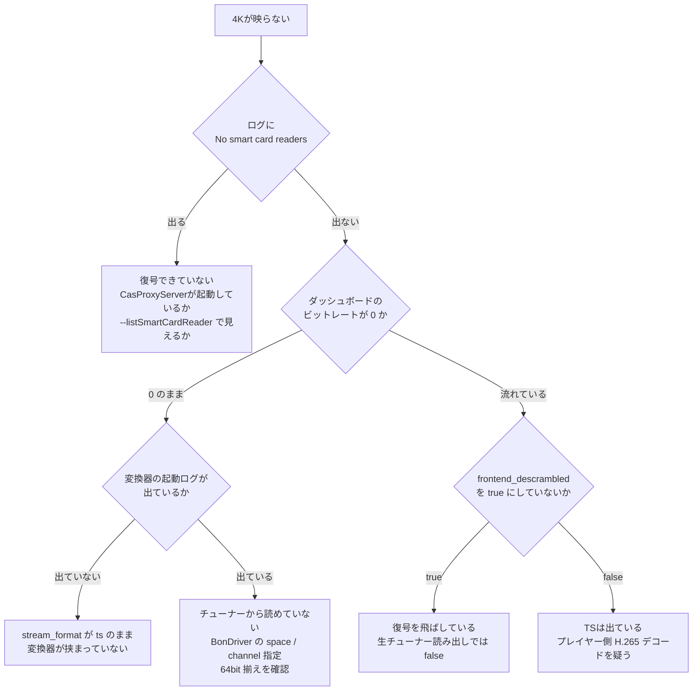
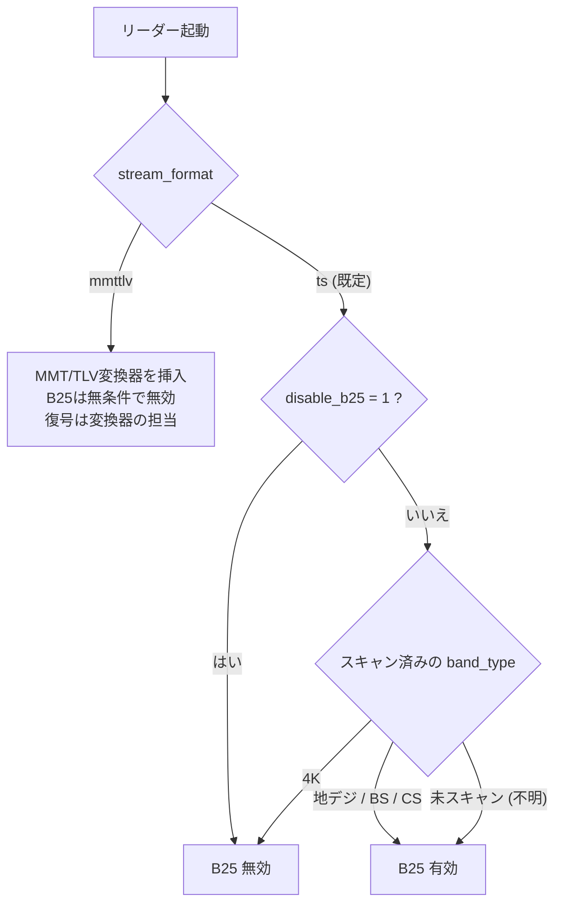
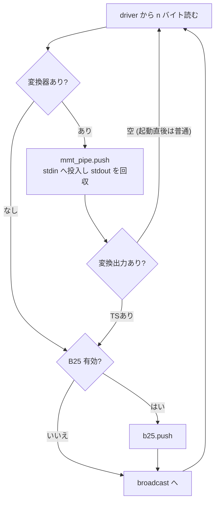

# BS4K (高度BSデジタル) 対応

## 方式: 生MMT/TLVは本体で読み、変換だけdantto4kに渡す

4K放送は MMT/TLV 多重で、MPEG-2 TS ではない。recisdb-proxy のパイプライン
(TS解析・EPG・ロゴ・チャンネル列挙・録画・全セッション) はすべて TS 前提なので、
**TS に変換してから broadcast に流す**。



4K以外の経路は一切変わらない。変換器が挟まるのは
`stream_format = 'mmttlv'` のドライバだけ。

変換器は [dantto4k](https://github.com/nekohkr/dantto4k) (Apache-2.0) の CLI。

### 変換器の入出力の制約 (ソースを読んで確定)

`~/prog/dantto4k` のソース (`src/dantto4k.cpp`) を読んで確定した事項。

実測での挙動:

| 呼び方 | 結果 |
|---|---|
| `dantto4k in.mmts out.ts` | 動く |
| `dantto4k in.mmts -` (出力が標準出力) | 動く |
| `type in.mmts \| dantto4k - -` (入力が標準入力) | **動かない**。出力は空のまま |

ソースから分かること:

- **名前付きパイプは入力に使えない。** ファイル入力のとき、進捗表示用に
  `tellg` / `seekg(0, end)` / `seekg(currentPos)` でサイズを取る。名前付きパイプは
  シーク不可なので failbit が立ち、以後の `read` は何も読まず `gcount()` が 0 を
  返し続ける。`eof()` にもならないので終了判定にも掛からない。
  **`--no-progress` を付けてもこのシークは実行される。**
- 単独の `-` は引数解析では正しく扱われている。cxxopts は
  `argv[i][0] == '-' && argv[i][1] != '\0'` でオプション判定するので、単独の `-` は
  位置引数になる
- 標準入力の経路はシークを通らず、Windows では
  `_setmode(_fileno(stdin), _O_BINARY)` も呼んでいる。実装は存在するが実測では
  動かない。**静的に読んだ範囲では原因を特定できていない**
- 入力は **5MB 単位のブロッキング読み** (`inputStream->read(buf, 5MB)`)。仮に
  標準入力が動いたとしても、13.6Mbps では 1 バッチあたり約 3 秒の遅延になる
- **デマルチプレクサは途中から同期できる。** 不正な TLV は 1 バイトずつ読み飛ばす
  (`mmtTlvDemuxer.cpp` の `demux`)。任意の位置から切り出した断片でも変換できるので、
  スキャンのバッチ方式が成立する

proxy 経由でも標準入力は同じ挙動になる (プロセスは生きたまま、OS のパイプバッファ
ぶん以外を読まない)。Rust 側の問題ではない — 送信スレッドがブロックされている
だけで、子プロセスが死んでいれば別のエラーになる。

そのため**チャンネルスキャンはファイル経由で変換する**。生 MMT/TLV を一時ファイル
に数秒ぶん貯めて `dantto4k in.mmts out.ts` で変換し、出てきた TS を解析器に渡す。
バッチ化による遅延はスキャンには影響しない (必要なのは SI だけ)。

**配信 (視聴・録画) は未対応。** 入力が「シーク可能なファイル」でなければならず、
標準入力は動かず、名前付きパイプはシークできない。**連続した入力を渡す手段が
現状ない。** 方向としては:

- 短いファイルを連続で変換して継ぎ合わせる。継ぎ目でデコーダがリセットされるため
  映像が途切れる可能性が高い
- 変換器側を直す (Apache-2.0)。標準入力の不具合を直すか、`--no-progress` のときは
  サイズ取得を省いてシーク不可の入力を受け付けるようにする。後者だけでも名前付き
  パイプが使えるようになる


変換は **broadcast の手前** に置く。購読者ごとに変換するのは無駄だし、
TS解析・EPG/ロゴ収集も TS しか解さないため。

### なぜ BonDriver ラッパーを使わないのか

dantto4k は `BonDriver_dantto4k.dll` も同梱していて、これは内側の BonDriver を
ロードしてインラインで変換する。理屈の上ではこちらなら proxy 側の変更はゼロで済む。

しかし**実際に試すと、MMT/TLV は流れているのに何も出力されない**状態になった。
そのため生の読み出しは本体が行い、dantto4k には変換機能だけを使わせる。

補足: dantto4k は**復調しない**。復調はチューナーのハードと BonDriver が行う。

## セットアップ

1. dantto4k を配置する
2. **ACAS 復号の手段を用意する** (下記「復号が最大のハマりどころ」)
3. `recisdb-proxy.toml` に `[mmttlv]` を書く:

```toml
[mmttlv]
command_path = "C:\\DTV\\BonDriver\\dantto4k.exe"
cas_proxy_server = "127.0.0.1:24000"   # または smart_card_reader_name
```

4. 4Kチューナーの BonDriver を登録し、**MMT/TLV を出すことを明示する**:

```sql
UPDATE bon_drivers SET stream_format = 'mmttlv' WHERE dll_path = '...';
```

これはスキャン結果から導出できない。スキャンは TS を解析するので、変換器が
経路に入るまで分類する材料が存在しない。ドライバの性質として登録時に決める。

5. スキャンを実行

`stream_format = 'mmttlv'` のドライバでは B25 (libaribb25) を無条件で切る。
復号は変換器の担当なので、TS 用の復号器を通す意味がない。

### スキャンも同じ変換器を通る

チャンネルスキャンは配信経路 (`SharedTuner`) を使わず、**BonDriver を直接開いて
自分で TS を読み**、`analyze_ts_stream` が PAT/NIT/SDT を解析する。
そのままでは 0x47 を探して "resync failed" を出し続けるだけなので、
`stream_format = 'mmttlv'` のドライバではスキャン側にも変換器を挟む。



変換器はチャンネルごとに起動して解析が終わると落とす。

**復号できていない場合はスキャンを即座に打ち切る。** 変換器は正常終了しながら
暗号化された TS を出し続けるため、放置すると解析が永久に完成せず、
1チャンネルあたり `ts_read_timeout_ms` (既定5分) を丸ごと待つ。8チャンネルなら
40分沈黙したうえ理由も出ない。stderr の該当メッセージを掴んだ時点でエラーにする。

## 復号が最大のハマりどころ

**変換器は復号できなくても正常終了し、フルサイズの TS を書く。**
中身は暗号化されたままなので再生できない。「変換は通るのに映らない」の正体は
だいたいこれ。

実機の統計がその状態を示していた例:

```
No smart card readers are available     ← 8回出ている
...
PacketId: 0xFFF1, Count: 613, ECM       ← スクランブルされている
PacketId: 0xFFF2, Count: 239, EMM
PacketId: 0xF300, Count: 133361, HEVC(3840x2160)   ← 変換自体は成功
```

`--casProxyServer` を渡していても、**実際に CasProxyServer が起動していないと
ローカル PC/SC にフォールバックして**この状態になる。

対応として、本体は変換器の stderr を監視し、該当メッセージを掴んだら
エラーとしてログに出す (`tuner/mmt_pipe.rs`)。黙って暗号文を配信しない。



変換器は**エラー終了しない**。この行が唯一の手がかりになる。

確認手順:

- `dantto4k.exe --listSmartCardReader` でリーダーが見えるか
- CasProxyServer を使うなら、指定アドレスで実際に待ち受けているか
- 復号が通れば `No smart card readers are available` が出なくなる

`--frontend-descrambled` は前段で復号済みの場合のオプション。
**生のチューナー出力を読む本構成では使わない** (何も復号されていないため)。
スクランブルされたままの入力に指定すると、警告すら出ずに再生できない TS が出る。

### 切り分け



### NullPacket が大半なのは正常

```
TLV:
 - HeaderCompressedIpPacket: 149091
 - NullPacket: 578067
```

TLV の約79%が Null。実データは HeaderCompressedIpPacket 側。帯域の穴埋めなので
異常ではない。「データが出ていない」と誤読しやすい。

## 実装済みの対応

### チャンネル分類 (`classify_nid`)

変換後の TS は**元の network_id 0x000B を保持している**。実機で確認した値:

```
TSID 0xB070 / NID 0x000B (高度BSデジタル放送)
サービス (BS朝日4K): SID 0x97 / service_type 0x01
  映像 PID 0x100 stream_type 0x24 (H.265)
  音声 PID 0x110 stream_type 0x0F (AAC)
  字幕 PID 0x130 / 0x138
  PCR  PID 0x1FF
  ECM  PID 0x901 / CA system ID 0x0005
```

変換後のサービスは `service_type` が 4K 用の 0xAD ではなく通常の 0x01 なので、
**NID 以外に 4K を判別する手がかりはない**。

`BandType::from_nid` は元から 0x000B / 0x000C を `FourK` にしていたが、
チャンネル列挙が使う `classify_nid` には 4K の分岐がなく、地デジの NID 範囲
(0x7800–0x7FF0) 外なので `Terrestrial(Unknown(11))` に落ちていた。分類器が
2つあって食い違っていた状態。現在は両方 4K を返す。

**空間の並びは 地デジ → BS → CS → BS4K で、BS4K は必ず末尾。**
空間インデックスはクライアントの `.ch2` / `ChSet5` のアドレスそのものなので、
途中に挿すと以降が全部ずれる。末尾なら 4K のない環境のインデックスは変わらない。

> **注意**: 4K チャンネルを既にスキャン済みだった環境では、これまで 4K が
> "Unknown" 空間として地デジの並びの中にソートされており、BS/CS のインデックスが
> ずれていた。その環境では `.ch2` / `ChSet5` の再生成が必要。

### B25 (ARIB STD-B25) の無効化

変換器は ACAS を復号済みにするが、**PMT には CA 記述子が残る**。しかもその
CA system ID は 0x0005 で、これは我々の B-CAS シム
(`b25-sys/src/bindings/ffi.rs`) が名乗る ID と完全に一致する。libaribb25 は
`find_ca_descriptor_pid` で一致する ECM PID を掴むため、4K のストリームでも
B25 が起動してしまう。

実際には ECM パケットは流れていない (PID 別集計に 0x901 が現れない) ので、
復号済みの現状では素通りする。ただし `strip: true` で動かしているため、
「スクランブル済みと判定されて映像パケットが削除される」経路が一歩手前にある。

対応:

- **帯域が 4K のチャンネルでは B25 を自動で外す。** 判定は `tuner/acquire.rs`
  で行う。全選局経路が通る唯一の絞り込み点で、DB ハンドルを持っているのも
  ここだけ
- **`bon_drivers.disable_b25` で手動指定もできる** (migration 019)。4K 以外の
  「既に復号済みのソース」はストリームから判別できないため
- **未スキャンで帯域が分からないチャンネルは B25 有効のまま。** 不要な復号は
  無駄なだけだが、必要な復号を外すと映像が出ない
- **`stream_format = 'mmttlv'` のドライバは帯域を見るまでもなく B25 を切る。**
  復号は変換器の担当。こちらはスキャン前でも効くので、上の「未スキャンなら
  有効のまま」より優先される

### リーダー起動時のステージ選択

判定はすべて `tuner/acquire.rs` で行う。全選局経路が通る唯一の絞り込み点で、
DB ハンドルを持っているのもここだけ。



未スキャンで有効側に倒すのは、不要な復号は無駄なだけで済むのに対し、
必要な復号を外すと映像が出ないため。

### チャンク1個の流れ



変換器への書き込みは上限付きバックログ越し。変換器が詰まってもチューナーの
読み取りループは止めない (止めると BonDriver 側のバッファが溢れる)。
溢れた分は破棄して計上する。

手動指定は現状 SQL で行う (Web API / ダッシュボードには未露出):

```sql
UPDATE bon_drivers SET disable_b25 = 1 WHERE dll_path = '...BonDriver_dantto4k.dll';
```

## 動作するもの (実機の PID 別集計で確認)

変換後の TS には SI が一式揃っている。

| PID | 内容 | 影響する機能 |
|---|---|---|
| 0x0000 | PAT | 選局・サービス解決 |
| 0x0010 | NIT | スキャン (physical_ch / remote_control_key) |
| 0x0011 | SDT | スキャン (サービス名・service_type) |
| 0x0012 | H-EIT | **番組表 (EPG) が動く** |
| 0x0014 | TOT | 時刻 |
| 0x0024 | BIT | — |
| 0x0029 | CDT | **ロゴ収集が動く** |

## 未対応 / 要確認

- **プレビュー / エンコードプロファイル**: 映像は H.265 (stream_type 0x24)。
  既定の `preview-h264` プロファイルは `--interlace tff --vpp-deinterlace normal`
  を渡すが、**BS4K は 2160/59.94p のプログレッシブ**なのでこの指定は誤り。
  4K 用プロファイル (デインタレースなし + スケール指定) が要る。

  単にプロファイル行を足すだけでは足りない: プレビューは
  `get_encode_profile_by_purpose("preview")` で **purpose が preview の
  有効な行を1つ選ぶだけ**で、チャンネルの帯域を見ていない
  (`web/stream.rs:246`)。帯域別に選ばせるには、プロファイルを読む時点
  (`web/stream.rs:371` 付近、いまは `sid` しかスコープに無い) でチャンネルの
  `band_type` を解決する配線が要る。実機のエンコーダなしでは検証できないため
  未着手
- **ダッシュボード (Vue) のフォーム露出**。Web API 側は対応済みで、
  `GET/POST/PATCH /api/bondrivers` が `stream_format` と `disable_b25` を
  読み書きする。画面から設定できるようにするには `web-ui/` 側の作業が要る
- **Drop カウント**: 実機の PID 別集計では全 PID に少量の Drop が出ていた
  (映像 794484 パケット中 57)。変換器が PSI を再生成する際に連続性カウンタが
  飛んでいる可能性がある。ダッシュボードの品質表示に常時 Drop が出るなら、
  4K では計上の仕方を見直す必要がある
- **Mirakurun 互換 API**: 出力は `FourK → "BS"`、入力は `BS4K` も受け付ける
  (`web/mirakurun.rs`)。EPGStation 同梱の `api.d.ts` に `BS4K` が無いことを
  実コードで確認済み — 根拠と判断は `docs/EPGSTATION_COMPAT.md` §4 に記載。
  EPGStation が 4K サービス (H.265 / 2160p) を録画・再生でどう扱うかは未検証。
  dantto4k の README には PT4K + Mirakurun 運用時のタイムアウト問題への言及が
  あり、本プロジェクトの Mirakurun 互換 API でも該当する可能性がある
- **Linux**: 変換は CLI パイプなので方式としては動くはずだが、Linux 側で 4K
  チューナーの生 MMT/TLV をどう読み出すか (DVB 経由の可否) は未検証

## なぜソースを取り込まない (CLI に留める) のか

- dantto4k は**アプリケーション**であってライブラリではない
  (`dllmain.cpp` / `bonTuner.cpp`)。ライブラリ境界を切り出す作業が要る
- ビルドに tsduck・OpenSSL・PC/SC を引き込む
- ライセンスは Apache-2.0。本リポジトリ root は GPLv3 なので取り込み自体は
  可能だが、各クレートが宣言している `MIT OR Apache-2.0` の MIT 側を潰す
- プロセス分離なら、変換器の更新に追従するのがバイナリの差し替えだけで済む

Rust での再実装は MMT/TLV 逆多重化・MPU/MFU 再構成・MMT-SI→PSI/SI 変換・
ACAS (AES)・ARIB B24 変換を全部書くことになり、得るものに対して割に合わない。
