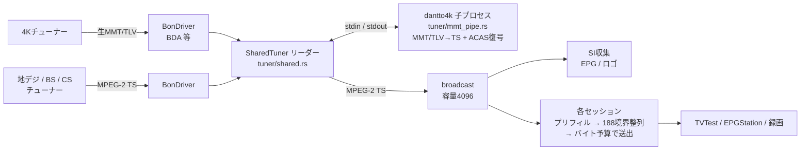
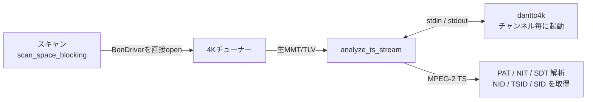
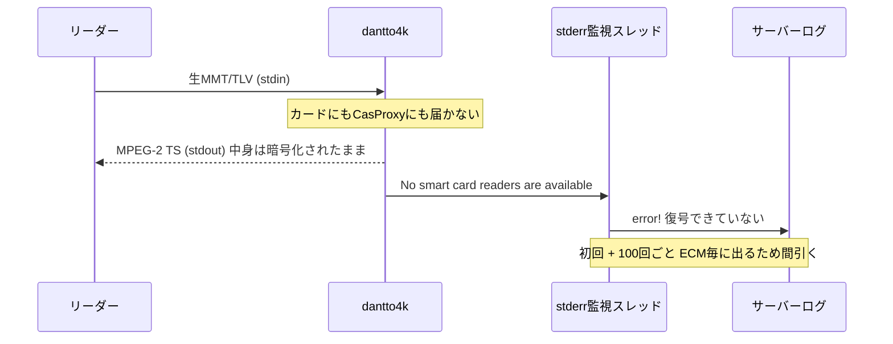
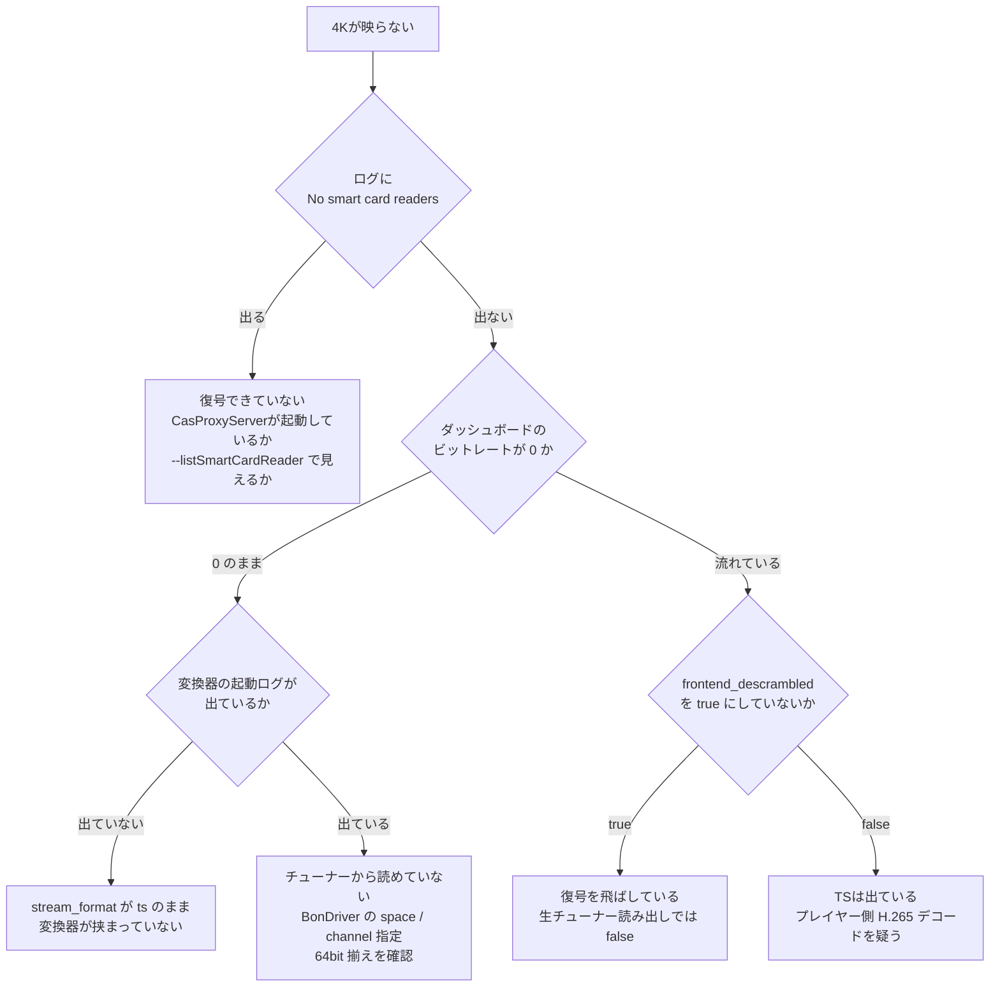
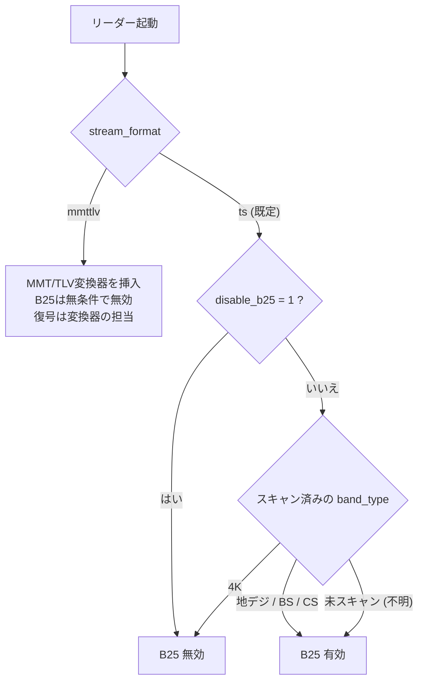
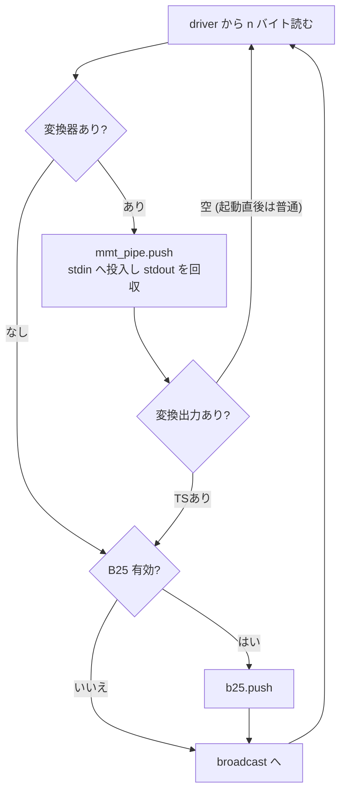

# BS4K (高度BSデジタル) 対応

## 方式: 生MMT/TLV方式とBonDriverラッパー方式

4K放送は MMT/TLV 多重で、MPEG-2 TS ではない。recisdb-proxy のパイプライン
(TS解析・EPG・ロゴ・チャンネル列挙・録画・全セッション) はすべて TS 前提なので、
**TS に変換してから broadcast に流す**。



4K以外の経路は一切変わらない。変換器が挟まるのは
`stream_format = 'mmttlv'` のドライバだけ。

実機の `BonDriver_dantto4k.dll` は `stream_format = 'ts'` で登録され、BonDriver内部で
MMT/TLVをTSへ変換するラッパー方式で動作している。実測ではBS日テレ4K、BS朝日4K、
BS-TBS 4K、BSテレ東4K、BSフジ4KでNID=0x000BとSID/TSID/SDTを取得できた。
この構成では `MmtPipe` は通らず、`[mmttlv]` の外部変換器設定も使わない。

ラッパー方式では `stream_format = 'ts'` は通常TSと同じ扱いになる。SI取得に失敗した
チャンネルは4Kと自動判定できないため、既に復号済みのラッパーなら `disable_b25 = true`
をドライバ単位で設定する。設定変更後はリーダーを再起動し、検証後に元へ戻す。

変換器は [dantto4k](https://github.com/nekohkr/dantto4k) (Apache-2.0) の CLI。

### 変換器には修正が要る

素の dantto4k は連続した入力を受け取れない。ソース (`src/dantto4k.cpp`) を読んで
原因を特定し、上流に出せる形で修正した (`~/prog/dantto4k`)。

**修正前の問題**

- **シーク不可の入力を受け付けない。** 進捗表示用に `tellg` / `seekg` で入力サイズを
  取る。名前付きパイプや FIFO はシークできないので failbit が立ち、以後の `read` は
  何も読まず `gcount()` が 0 を返し続ける。`eof()` にもならないので終了判定にも
  掛からず、プロセスは生きたまま何も変換しない。**`--no-progress` を付けても
  このシークは実行される**
- **5MB 単位のブロッキング読み。** `istream::read` は EOF 以外では要求サイズが
  揃うまで返らない。13.6Mbps の生ストリームでは 5MB 溜まるまで約3秒、何も変換
  しない
- **終端判定が `gcount() == 0 && eof()`。** 短い読み込みは eofbit と同時に failbit を
  立て、failbit が立つと以後の `read()` は何もしない。最後の端数チャンクの後に
  無言で止まる

FIFO で実測した結果 (修正前 → 修正後): `tellg()` が `-1` → 正常、ストリーム状態が
`fail` → `good`、読めたバイト数が **0 → 300,000**。

**修正内容** (`~/prog/dantto4k` の `545acd4`、38行追加/7行削除)

- サイズ取得は `--no-progress` のときは行わず、失敗しても `clear()` で復帰する
- 読み込み単位を 64KB にする。ファイル入力は一瞬で埋まるので影響なし
- 終端判定を `eof()` だけで行い、状態を `clear()` する

**この修正を入れた変換器が必要。** 素のビルドでは標準入力から何も読まないため、
`MmtPipe` の停滞検出がエラーを出して止まる。

### ラッパー方式の制約

dantto4k は `BonDriver_dantto4k.dll` も同梱していて、これは内側の BonDriver を
ロードしてインラインで変換する。理屈の上ではこちらなら proxy 側の変更はゼロで済む。

過去の別環境では、MMT/TLVは流れているのにラッパー出力が無い事例があった。その場合は
生の読み出し + 外部変換方式へ切り替える。TSを返す環境を一律に `mmttlv` と登録すると
二重変換で壊れる。

補足: dantto4k は**復調しない**。復調はチューナーのハードと BonDriver が行う。

## セットアップ

## 障害診断ログ

4Kリーダーは10秒ごとに `[MmtPipe] status` をINFO出力する。`input` はBonDriverから受け取ったMMT/TLV、`output` は変換器stdoutのTS、`queued/capacity` はstdin待ち行列、`dropped` は投入できず破棄したチャンク。`no_output_for` が30秒に達した場合は変換器のstdout停止としてERRORになる。stderrは未知行もWARNへ出し、復号失敗、プロセス終了、変換器停滞を区別できる。

`GET /api/tuners` に `mmt_converter` 診断を載せる。`active=false` はそのBonDriverの実行中リーダーに変換器状態が無い、`output_bytes=0` かつ `input_bytes>0` は変換器が入力を受けたがTSを返していない状態を示す。ダッシュボードのBonDriver画面にも表示する。

実機では次を実行し、スキャン対象の全BonDriver列挙とNHK BS4Kのログを保存する。

```sh
curl -sS https://<host>/api/tuners
curl -sS http://<host>/api/logs?limit=1000
```

スキャン完了後、`enumerate_spaces_and_channels` のspace/channel数、`NID=0x000B` の各 `TSID`、`PAT/NIT/SDT`、`input/output/dropped` を突き合わせる。ラッパー方式では `MmtPipe` の値は出ないため、`PAT/NITは有るがSDT無し` と `NID/TSID/SID=0` の仮登録を確認する。`output=0` は外部変換方式でのACASまたは古いdantto4k、`dropped>0` は変換器スループット不足を示す。

1. dantto4k を配置する
2. **ACAS 復号の手段を用意する** (下記「復号が最大のハマりどころ」)
3. `recisdb-proxy.toml` に `[mmttlv]` を書く:

```toml
[mmttlv]
command_path = "C:\\DTV\\BonDriver\\dantto4k.exe"
cas_proxy_server = "127.0.0.1:24000"   # または smart_card_reader_name
```

4. 4Kチューナーの BonDriver を登録し、**MMT/TLV を出すことを明示する**:

```sql
UPDATE bon_drivers SET stream_format = 'mmttlv' WHERE dll_path = '...';
```

これはスキャン結果から導出できない。スキャンは TS を解析するので、変換器が
経路に入るまで分類する材料が存在しない。ドライバの性質として登録時に決める。

5. スキャンを実行

`stream_format = 'mmttlv'` のドライバでは B25 (libaribb25) を無条件で切る。
復号は変換器の担当なので、TS 用の復号器を通す意味がない。

### スキャンも同じ変換器を通る

チャンネルスキャンは配信経路 (`SharedTuner`) を使わず、**BonDriver を直接開いて
自分で TS を読み**、`analyze_ts_stream` が PAT/NIT/SDT を解析する。そのままでは
0x47 を探して "resync failed" を出し続けるだけなので、`stream_format = 'mmttlv'` の
ドライバではスキャン側にも同じ変換器を挟む。



一時ファイルは使わない。デマルチプレクサは不正な TLV を 1 バイトずつ読み飛ばして
再同期する (`mmtTlvDemuxer.cpp` の `demux`) ので、生ストリームの途中から流し込んでも
同期できる。

**復号できていない場合はスキャンを即座に打ち切る。** 変換器は正常終了しながら
暗号化された TS を出し続けるため、放置すると解析が永久に完成せず、1チャンネル
あたり `ts_read_timeout_ms` (既定5分) を丸ごと待つ。8チャンネルなら40分沈黙した
うえ理由も出ない。stderr の該当メッセージを掴んだ時点でエラーにする。

## 復号が最大のハマりどころ

**変換器は復号できなくても正常終了し、フルサイズの TS を書く。**
中身は暗号化されたままなので再生できない。「変換は通るのに映らない」の正体は
だいたいこれ。

実機の統計がその状態を示していた例:

```
No smart card readers are available     ← 8回出ている
...
PacketId: 0xFFF1, Count: 613, ECM       ← スクランブルされている
PacketId: 0xFFF2, Count: 239, EMM
PacketId: 0xF300, Count: 133361, HEVC(3840x2160)   ← 変換自体は成功
```

`--casProxyServer` を渡していても、**実際に CasProxyServer が起動していないと
ローカル PC/SC にフォールバックして**この状態になる。

対応として、本体は変換器の stderr を監視し、該当メッセージを掴んだら
エラーとしてログに出す (`tuner/mmt_pipe.rs`)。黙って暗号文を配信しない。



変換器は**エラー終了しない**。この行が唯一の手がかりになる。

確認手順:

- `dantto4k.exe --listSmartCardReader` でリーダーが見えるか
- CasProxyServer を使うなら、指定アドレスで実際に待ち受けているか
- 復号が通れば `No smart card readers are available` が出なくなる

`--frontend-descrambled` は前段で復号済みの場合のオプション。
**生のチューナー出力を読む本構成では使わない** (何も復号されていないため)。
スクランブルされたままの入力に指定すると、警告すら出ずに再生できない TS が出る。

### 切り分け



### NullPacket が大半なのは正常

```
TLV:
 - HeaderCompressedIpPacket: 149091
 - NullPacket: 578067
```

TLV の約79%が Null。実データは HeaderCompressedIpPacket 側。帯域の穴埋めなので
異常ではない。「データが出ていない」と誤読しやすい。

## 実装済みの対応

### チャンネル分類 (`classify_nid`)

変換後の TS は**元の network_id 0x000B を保持している**。実機で確認した値:

```
TSID 0xB070 / NID 0x000B (高度BSデジタル放送)
サービス (BS朝日4K): SID 0x97 / service_type 0x01
  映像 PID 0x100 stream_type 0x24 (H.265)
  音声 PID 0x110 stream_type 0x0F (AAC)
  字幕 PID 0x130 / 0x138
  PCR  PID 0x1FF
  ECM  PID 0x901 / CA system ID 0x0005
```

変換後のサービスは `service_type` が 4K 用の 0xAD ではなく通常の 0x01 なので、
**NID 以外に 4K を判別する手がかりはない**。

`BandType::from_nid` は元から 0x000B / 0x000C を `FourK` にしていたが、
チャンネル列挙が使う `classify_nid` には 4K の分岐がなく、地デジの NID 範囲
(0x7800–0x7FF0) 外なので `Terrestrial(Unknown(11))` に落ちていた。分類器が
2つあって食い違っていた状態。現在は両方 4K を返す。

**空間の並びは 地デジ → BS → CS → BS4K で、BS4K は必ず末尾。**
空間インデックスはクライアントの `.ch2` / `ChSet5` のアドレスそのものなので、
途中に挿すと以降が全部ずれる。末尾なら 4K のない環境のインデックスは変わらない。

> **注意**: 4K チャンネルを既にスキャン済みだった環境では、これまで 4K が
> "Unknown" 空間として地デジの並びの中にソートされており、BS/CS のインデックスが
> ずれていた。その環境では `.ch2` / `ChSet5` の再生成が必要。

### B25 (ARIB STD-B25) の無効化

変換器は ACAS を復号済みにするが、**PMT には CA 記述子が残る**。しかもその
CA system ID は 0x0005 で、これは我々の B-CAS シム
(`b25-sys/src/bindings/ffi.rs`) が名乗る ID と完全に一致する。libaribb25 は
`find_ca_descriptor_pid` で一致する ECM PID を掴むため、4K のストリームでも
B25 が起動してしまう。

実際には ECM パケットは流れていない (PID 別集計に 0x901 が現れない) ので、
復号済みの現状では素通りする。ただし `strip: true` で動かしているため、
「スクランブル済みと判定されて映像パケットが削除される」経路が一歩手前にある。

対応:

- **帯域が 4K のチャンネルでは B25 を自動で外す。** 判定は `tuner/acquire.rs`
  で行う。全選局経路が通る唯一の絞り込み点で、DB ハンドルを持っているのも
  ここだけ
- **`bon_drivers.disable_b25` で手動指定もできる** (migration 019)。4K 以外の
  「既に復号済みのソース」はストリームから判別できないため
- **未スキャンで帯域が分からないチャンネルは B25 有効のまま。** 不要な復号は
  無駄なだけだが、必要な復号を外すと映像が出ない
- **`stream_format = 'mmttlv'` のドライバは帯域を見るまでもなく B25 を切る。**
  復号は変換器の担当。こちらはスキャン前でも効くので、上の「未スキャンなら
  有効のまま」より優先される

### リーダー起動時のステージ選択

判定はすべて `tuner/acquire.rs` で行う。全選局経路が通る唯一の絞り込み点で、
DB ハンドルを持っているのもここだけ。



未スキャンで有効側に倒すのは、不要な復号は無駄なだけで済むのに対し、
必要な復号を外すと映像が出ないため。

### チャンク1個の流れ



変換器への書き込みは上限付きバックログ越し。変換器が詰まってもチューナーの
読み取りループは止めない (止めると BonDriver 側のバッファが溢れる)。
溢れた分は破棄して計上する。

手動指定は現状 SQL で行う (Web API / ダッシュボードには未露出):

```sql
UPDATE bon_drivers SET disable_b25 = 1 WHERE dll_path = '...BonDriver_dantto4k.dll';
```

## 動作するもの (実機の PID 別集計で確認)

変換後の TS には SI が一式揃っている。

| PID | 内容 | 影響する機能 |
|---|---|---|
| 0x0000 | PAT | 選局・サービス解決 |
| 0x0010 | NIT | スキャン (physical_ch / remote_control_key) |
| 0x0011 | SDT | スキャン (サービス名・service_type) |
| 0x0012 | H-EIT | **番組表 (EPG) が動く** |
| 0x0014 | TOT | 時刻 |
| 0x0024 | BIT | — |
| 0x0029 | CDT | **ロゴ収集が動く** |

### プレビュー用エンコードプロファイル (2026-08-22 対応)

映像は H.265 (stream_type 0x24)、**2160/59.94p のプログレッシブ**。既定の
`preview-h264` プロファイルは `--interlace tff --vpp-deinterlace normal` を
渡すうえに解像度もそのままなので、4K に適用すると (1) プログレッシブ素材を
デインタレースし、(2) 2160p をリアルタイムで encode しようとして追いつかず、
再生がブツブツ途切れる。

対応: `purpose = 'preview4k'` の専用プロファイル `preview-4k` を seed し
(`database/encode_profile.rs::preview_4k_encode_args_ffmpeg`、デインタレース
なし + `scale=1920:1080` へ縮小 + VBR 4Mbps)、`?profile=preview` の
プロファイル選択をチャンネルの帯域で分岐させた
(`web/stream.rs::PreviewBand`)。判定は `band_type` ではなく **NID**
(`classify_nid`) で行う — `band_type` はスキャンでしか埋まらず手動投入行では
欠けるが、NID は必ず網を示すため。`preview4k` 行を管理者が削除・無効化した
場合は通常プロファイルへフォールバックする (途切れるプレビューでも、
再生できないよりはよい)。

`preview_setup` が選んだ映像エンコーダを通常プレビューと4Kプレビューの両方へ
反映する。旧版が seed した rigaya 形式の既定値と完全一致する既存行だけを ffmpeg
形式へ移行する。管理者が編集した値は上書きしない。

2026-08-30 の実機検証では、旧 rigaya 引数は ffmpeg が `-avhw` を拒否し、HTTP
200の直後に0バイトで終了した。ffmpeg形式へ一時変更すると H.264 1920x1080/
59.94p、AAC、timed ID3を含むTSを生成し、実効ビットレートは3.56〜3.64Mbpsだった。
映像PTSの最大間隔は66.7msで、100ms超の間隔は0件だった。

ただし実機の `h264_qsv` はHEVCのsoftware decodeとsoftware scaleを含む構成で、
20秒の取得中に9.18秒分しか生成できず、処理速度は約0.46倍だった。QSVのhardware
decodeと`scale_qsv`も試したが、GPUのtexture生成が`80070057`で失敗した。この実機
では1080p/59.94p・4Mbpsという出力設定だけではリアルタイム処理に足りない。
ゼロバイト終了は解消するが、連続プレビューには対応GPU/ドライバー、または別の
ハードウェア変換構成が必要である。

## 未対応 / 要確認

### 2026-08-30 実機検証メモ

- **実測**: `/api/channels` は4K 5サービスを NID=11、`band_type=FourK` で返した。
  ch2「ＮＨＫ ＢＳ８Ｋ」とch7「ＷＯＷＯＷ ４Ｋ」は名前だけで、NID/TSID/SID=0。
- **実測**: ch2選局はsignal=100.0dBでも45秒間TS 0バイト。B25有効時は30秒で
  `no TS data` 停止。`disable_b25=true` の実験ではB25無効ログが出たが、TS 0バイトは
  変わらず、B25だけではch2の無出力を説明できない。
- **実測**: 実験後 `disable_b25=false` へ復元済み。実機の `stream_format=ts` は維持。
- **推測**: ch2はラッパー内部の8K入力または当該サービス出力に未対応の可能性がある。
  NHK BS4Kが同一トランスポンダに同居するかは、ラッパーがTSを返す状態でPAT/SDT/NITを
  採取して確認する必要がある。
- **実測**: `/mirakurun/api/services/1100141/stream` は競合時503、再試行時も実TS未取得。
  視聴成功、H.265映像、EIT/H-EIT、WOWOWのACAS復号は未確認。

- **生TS配信は検証済み。** 実機 (BonDriver_dantto4k ラッパー、`stream_format=ts`) で
  同一チャンネル (BS朝日4K / SID 151) を 150 秒流し、f4824d0 と 70dce4c を比較した。

  | 指標 | f4824d0 (修正前) | 70dce4c (修正後) |
  |---|---|---|
  | ネイティブ `GetTsStream` 呼び出し | 399MB に対し **15 回** | 484MB に対し **1287 回** |
  | `max_chunk` | 8.7MB → 68,391,204 と**単調増加** | **1,084,384 で一定** |
  | `pending_peak` | 68,129,060 まで増加 | **822,240 で一定** |
  | 滞留時間 (18Mbps 換算) | 約 30 秒 | 約 0.4 秒 |
  | 到着間隔 90ms 以上 | 229 / 4627 回 | 139 / 4551 回 |
  | 到着間隔 p99 | 173ms | 144ms |

  修正前は pending を 256KB ずつ drain する各 iteration で `WaitTsStream(100ms)` を
  呼び、その間にドライバ側が次の chunk を溜める正のフィードバックで遅延とメモリが
  発散していた。reader は `remaining > 0` の間 wait を省略し、read buffer を実測
  chunk へ追従させる (実機では 262144 → 2097152 へ一度だけ拡張し、以後不変)。
  256MiB 超過時は任意位置で捨てて継続せず、reader 全体を `ReaderFailed` として
  再 open する。

  TS の内容も検証済み: 223,101 packets すべて `transport_scrambling_control = 0`
  (復号済み)、continuity counter の不連続 0 件。

  残っている挙動: 300〜450ms の到着間隔が数十秒おきに十数回まとまって出ることがある
  (180 秒の測定で t=155〜168s に集中)。発散は止まったが原因は未特定。
  録画とプレイヤーの H.265/2160p 表示は未検証。
- **修正版 dantto4k のビルド確認**。手元では tsduck が無くビルドできていない
- **ダッシュボード (Vue) のフォーム露出**。Web API 側は対応済みで、
  `GET/POST/PATCH /api/bondrivers` が `stream_format` と `disable_b25` を
  読み書きする。画面から設定できるようにするには `web-ui/` 側の作業が要る
- **Drop カウント**: 実機の PID 別集計では全 PID に少量の Drop が出ていた
  (映像 794484 パケット中 57)。変換器が PSI を再生成する際に連続性カウンタが
  飛んでいる可能性がある。ダッシュボードの品質表示に常時 Drop が出るなら、
  4K では計上の仕方を見直す必要がある
- **Mirakurun 互換 API**: 出力は `FourK → "BS"`、入力は `BS4K` も受け付ける
  (`web/mirakurun.rs`)。EPGStation 同梱の `api.d.ts` に `BS4K` が無いことを
  実コードで確認済み — 根拠と判断は `docs/EPGSTATION_COMPAT.md` §4 に記載。
  EPGStation が 4K サービス (H.265 / 2160p) を録画・再生でどう扱うかは未検証。
  dantto4k の README には PT4K + Mirakurun 運用時のタイムアウト問題への言及が
  あり、本プロジェクトの Mirakurun 互換 API でも該当する可能性がある
- **Linux**: 変換は CLI パイプなので方式としては動くはずだが、Linux 側で 4K
  チューナーの生 MMT/TLV をどう読み出すか (DVB 経由の可否) は未検証

## なぜソースを取り込まない (CLI に留める) のか

- dantto4k は**アプリケーション**であってライブラリではない
  (`dllmain.cpp` / `bonTuner.cpp`)。ライブラリ境界を切り出す作業が要る
- ビルドに tsduck・OpenSSL・PC/SC を引き込む
- ライセンスは Apache-2.0。本リポジトリ root は GPLv3 なので取り込み自体は
  可能だが、各クレートが宣言している `MIT OR Apache-2.0` の MIT 側を潰す
- プロセス分離なら、変換器の更新に追従するのがバイナリの差し替えだけで済む

Rust での再実装は MMT/TLV 逆多重化・MPU/MFU 再構成・MMT-SI→PSI/SI 変換・
ACAS (AES)・ARIB B24 変換を全部書くことになり、得るものに対して割に合わない。
